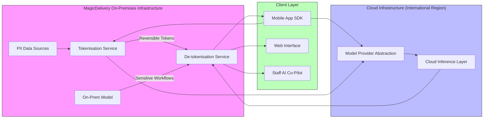
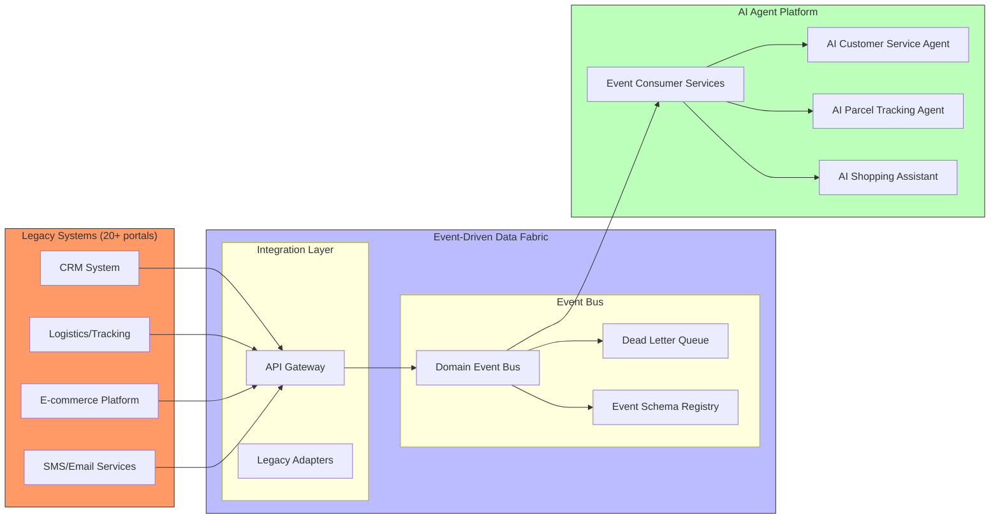
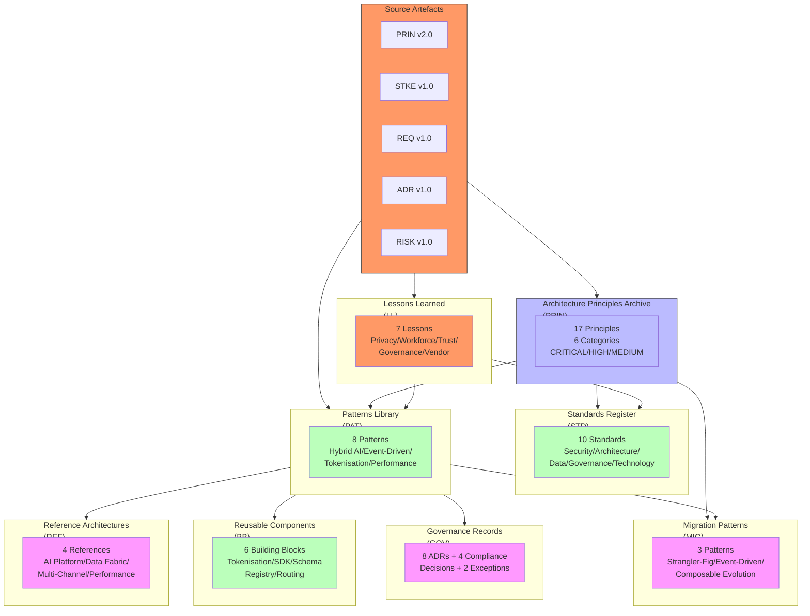

# Architecture Repository: AgenticEA — MagicDelivery Agent AI Transformation

> **Template Origin**: Official | **ArcKit Version**: 5.15.2 | **Command**: `/arckit:architecture-repository`

## Document Control

| Field | Value |
|-------|-------|
| Document ID | ARC-001-REPO-v1.0 |
| Document Type | Architecture Repository (REPO) |
| Project | 001 — AgenticEA: Agent AI Transformation |
| Classification | OFFICIAL |
| Status | DRAFT |
| Version | 1.0 |
| Created Date | 2026-07-01 |
| Last Modified | 2026-07-01 |
| Review Cycle | Quarterly |
| Next Review Date | 2026-10-01 |
| Owner | Program Delivery Team (Programme Director) |
| Reviewed By | PENDING |
| Approved By | PENDING |
| Distribution | Executive Leadership, Parcel Business, Digital Technology, Compliance/Legal, Program Delivery Team, Enterprise Architecture Review Board |

## Revision History

| Version | Date | Author | Changes | Approved By | Approval Date |
|---------|------|--------|---------|-------------|---------------|
| 1.0 | 2026-07-01 | ArcKit AI | Initial creation — Architecture Repository synthesising PRIN, STKE, REQ, ADR, and RISK artefacts into patterns library, standards register, reference architectures, governance records, reusable components, migration patterns, and lessons learned | PENDING | PENDING |

---

## Executive Summary

This document constitutes the **Architecture Repository** for the **AgenticEA — MagicDelivery Agent AI Transformation** programme (Project 001). It synthesises cross-project patterns, reusable assets, governance records, and architecture artefacts from five source documents:

- **ARC-000-PRIN-v2.0** — Enterprise Architecture Principles (17 principles across 6 categories)
- **ARC-001-STKE-v1.0** — Stakeholder Drivers & Goals Analysis (9 stakeholder groups, 12 drivers, 8 goals)
- **ARC-001-REQ-v1.0** — Project Requirements (8 business, 16 functional, 23 non-functional, 8 integration, 10 data requirements)
- **ARC-001-ADR-v1.0** — Architecture Decision Records (8 ADRs covering AI deployment, handoff, data, mobile, multi-channel, workforce, compliance, and performance)
- **ARC-001-RISK-v1.0** — Risk Register (30 risks across 6 categories)

The repository serves as the central knowledge store for the enterprise architecture practice, enabling pattern reuse, governance enforcement, and informed architectural decision-making across MagicDelivery's digital transformation programmes. MagicDelivery's enterprise context — 10,000+ staff, 10 million customers, 4,000 retail shops, and USD $18.5M programme budget — frames all architectural patterns and governance decisions documented herein.

### Repository Contents at a Glance

| Section | Count |
|---------|-------|
| Architecture Principles Archive | 17 principles (6 categories) |
| Standards Register | 10 standards |
| Patterns Library | 8 patterns |
| Reference Architectures | 4 references |
| Architecture Methods | 3 method adaptations |
| Governance Records | 8 ADRs |
| Reusable Components | 6 building blocks |
| Migration Patterns | 3 patterns |
| Lessons Learned | 7 lessons |
| Search Index | 12 keyword clusters |

---

## 1. Architecture Principles Archive

### 1.1 Principles Register

All 17 enterprise architecture principles from **ARC-000-PRIN-v2.0** are indexed here with their status, category, and cross-references to artefacts that implement or validate each principle.

| Principle ID | Name | Category | Criticality | Status | Source | Validated By |
|-------------|------|----------|-------------|--------|--------|------------|
| PRIN-001 | Business Outcome Alignment | Strategic | CRITICAL | Active | ARC-000-PRIN-v2.0 | BR-001, BR-008 |
| PRIN-002 | Composable Architecture | Strategic | HIGH | Active | ARC-000-PRIN-v2.0 | ADR-001, ADR-005 |
| PRIN-003 | AI-Augmented Operations | Strategic | HIGH | Active | ARC-000-PRIN-v2.0 | FR-001–FR-007 |
| PRIN-004 | Security by Design | Strategic | CRITICAL | Active | ARC-000-PRIN-v2.0 | ADR-001, ADR-007, NFR-S |
| PRIN-005 | Observability & Operational Excellence | Strategic | HIGH | Active | ARC-000-PRIN-v2.0 | FR-008–FR-012 |
| PRIN-006 | Data as a Product | Data | CRITICAL | Active | ARC-000-PRIN-v2.0 | ADR-003, DR-001 |
| PRIN-007 | Data Sovereignty & Governance | Data | CRITICAL | Active | ARC-000-PRIN-v2.0 | ADR-001, NFR-C-001 |
| PRIN-008 | Single Source of Truth | Data | HIGH | Active | ARC-000-PRIN-v2.0 | INT-001–INT-004 |
| PRIN-009 | Loose Coupling | Integration | HIGH | Active | ARC-000-PRIN-v2.0 | ADR-002, ADR-005 |
| PRIN-010 | Event-Driven Integration | Integration | MEDIUM | Active | ARC-000-PRIN-v2.0 | ADR-003 |
| PRIN-011 | Performance & Efficiency | Quality | HIGH | Active | ARC-000-PRIN-v2.0 | ADR-008, NFR-P |
| PRIN-012 | Availability & Reliability | Quality | CRITICAL | Active | ARC-000-PRIN-v2.0 | ADR-001, NFR-A |
| PRIN-013 | Maintainability & Evolvability | Quality | MEDIUM | Active | ARC-000-PRIN-v2.0 | ADR-006, ADR-008 |
| PRIN-014 | Infrastructure as Code | DevOps | HIGH | Active | ARC-000-PRIN-v2.0 | NFR-D |
| PRIN-015 | Automated Testing | DevOps | HIGH | Active | ARC-000-PRIN-v2.0 | NFR-D |
| PRIN-016 | Continuous Integration & Deployment | DevOps | HIGH | Active | ARC-000-PRIN-v2.0 | NFR-D |
| PRIN-017 | Legacy Modernization Strategy | Strategic | CRITICAL | Active | ARC-000-PRIN-v2.0 | ADR-004, ADR-006 |

### 1.2 Principles Version History

| Version | Date | Changes | Key Additions |
|---------|------|---------|---------------|
| 2.0 | 2026-07-01 | Scope refined to AgenticEA/MagicDelivery Agent AI Transformation; MagicDelivery-specific context added to PRIN-003 (AI-Augmented Operations) and PRIN-004 (Security by Design) | 10M customer scale, Privacy Act 1988, international data residency |
| 1.0 | 2026-07-01 | Initial creation — enterprise digital transformation principles | Generic enterprise principles |

### 1.3 Principles Applicability Matrix

| Principle | Business | Data | Application | Technology |
|-----------|----------|------|-------------|------------|
| PRIN-001 | ✓ | | ✓ | |
| PRIN-002 | | | ✓ | ✓ |
| PRIN-003 | | | ✓ | ✓ |
| PRIN-004 | | ✓ | ✓ | ✓ |
| PRIN-005 | | | ✓ | ✓ |
| PRIN-006 | | ✓ | ✓ | |
| PRIN-007 | | ✓ | ✓ | ✓ |
| PRIN-008 | | ✓ | ✓ | |
| PRIN-009 | | | ✓ | ✓ |
| PRIN-010 | | ✓ | ✓ | ✓ |
| PRIN-011 | | | ✓ | ✓ |
| PRIN-012 | | | ✓ | ✓ |
| PRIN-013 | | | ✓ | ✓ |
| PRIN-014 | | | | ✓ |
| PRIN-015 | | | ✓ | ✓ |
| PRIN-016 | | | ✓ | ✓ |
| PRIN-017 | ✓ | | ✓ | ✓ |

---

## 2. Standards Register

Standards are derived from the mandatory clauses ("MUST"/"SHOULD") in Architecture Principles (PRIN) and formalised decisions in ADRs. Each standard represents an enforceable requirement for project architecture designs.

| Standard ID | Name | Domain | Status | Last Review | Source |
|-------------|------|--------|--------|-------------|--------|
| STD-001 | Zero-Trust Identity & Access Control | Security | Active | 2026-07-01 | PRIN-004, ADR-001 |
| STD-002 | Event-Driven Integration Contract | Architecture | Active | 2026-07-01 | PRIN-010, ADR-003 |
| STD-003 | Data Classification & Residency | Data | Active | 2026-07-01 | PRIN-007, ADR-001 |
| STD-004 | AI Agent Interface Specification | Architecture | Active | 2026-07-01 | PRIN-003, ADR-005 |
| STD-005 | PII Tokenisation & De-tokenisation | Security | Active | 2026-07-01 | ADR-001, ADR-007 |
| STD-006 | Structured Telemetry & Observability | Technology | Active | 2026-07-01 | PRIN-005, ADR-008 |
| STD-007 | Human-in-the-Loop Escalation Protocol | Architecture | Active | 2026-07-01 | PRIN-003, ADR-002 |
| STD-008 | Compliance-by-Design Governance | Governance | Active | 2026-07-01 | PRIN-004, ADR-007 |
| STD-009 | Strangler-Fig Legacy Modernisation | Architecture | Active | 2026-07-01 | PRIN-017, ADR-004 |
| STD-010 | Performance Tier & Scaling Strategy | Technology | Active | 2026-07-01 | PRIN-011, ADR-008 |

### STD-001: Zero-Trust Identity & Access Control

- **Statement**: All access — human and machine — must be authenticated, authorised, and continuously verified. No network-based trust.
- **Scope**: All systems processing MagicDelivery customer data; all service-to-service interfaces.
- **Mandatory Controls**: Multi-factor authentication for human access; mutual TLS or signed tokens for service-to-service; secrets management via secure vault; network segmentation with minimal trust zones.
- **Exceptions**: None — non-negotiable per PRIN-004.

### STD-002: Event-Driven Integration Contract

- **Statement**: Non-real-time interactions between systems must use publish/subscribe patterns with versioned event schemas.
- **Scope**: All legacy-to-AI integrations; cross-system data synchronisation.
- **Mandatory Controls**: Published event schemas; dead letter queues; message durability guarantees; event audit trails.

### STD-003: Data Classification & Residency

- **Statement**: All data classified into four tiers (Public, Internal, Confidential, Restricted). Customer PII must remain within international data centres.
- **Scope**: All data stores, data pipelines, and AI training/processing systems.
- **Mandatory Controls**: Data classification performed for all data stores; residency requirements mapped to infrastructure; automated retention policies; least-privilege access controls.

### STD-004: AI Agent Interface Specification

- **Statement**: All AI agent interaction surfaces must expose structured, machine-consumable interfaces with deterministic contracts.
- **Scope**: All customer-facing and staff-facing AI agent implementations.
- **Mandatory Controls**: Structured input/output contracts; confidence score reporting; escalation triggers; interaction logging for audit.

### STD-005: PII Tokenisation & De-tokenisation

- **Statement**: Personally identifiable information must be tokenised before transmission to cloud AI model inference services. Tokenisation and de-tokenisation must occur within MagicDelivery-controlled infrastructure.
- **Scope**: All hybrid cloud inference workflows where PII is involved.
- **Mandatory Controls**: Cryptographic key management via HashiCorp Vault; automated integrity verification; dual-key redundancy; circuit breaker on tokenisation failure.

### STD-006: Structured Telemetry & Observability

- **Statement**: All systems must emit structured logs, metrics, and distributed traces enabling real-time monitoring and troubleshooting.
- **Scope**: All production systems and AI agent platforms.
- **Mandatory Controls**: Correlation IDs for request tracing; p50/p95/p99 latency metrics; error rate tracking; SLO-based alerting; capacity planning metrics.

### STD-007: Human-in-the-Loop Escalation Protocol

- **Statement**: AI agents must escalate to human agents when confidence falls below threshold, customer requests human interaction, or query involves high-risk topics.
- **Scope**: All customer-facing AI agent interactions.
- **Mandatory Controls**: Sub-30-second handoff latency; full context transfer including conversation history and confidence scores; automatic escalation for complaints, security, and legal topics.

### STD-008: Compliance-by-Design Governance

- **Statement**: Privacy Act 1988 (APP) compliance, ACCC consumer law obligations, and Fair Work Act requirements must be embedded into architecture and design processes, not bolted on pre-launch.
- **Scope**: All AI agent capabilities, data processing workflows, and customer-facing interactions.
- **Mandatory Controls**: Data Protection Impact Assessments (DPIA) before each feature launch; legal sign-off at each design gate; AI incident response within 4 hours.

### STD-009: Strangler-Fig Legacy Modernisation

- **Statement**: Legacy system modernisation must follow incremental strangler-fig patterns — wrapping, not big-bang replacement — with continuous business continuity.
- **Scope**: All legacy system integration and replacement activities.
- **Mandatory Controls**: Anti-corruption layers isolating legacy from new systems; business validation at each migration milestone; parallel operation period with fall-back capability; customer impact assessment for each migration step.

### STD-010: Performance Tier & Scaling Strategy

- **Statement**: Systems must operate within defined performance tiers with predictable latency targets, automated scaling, and graceful degradation.
- **Scope**: AI agent platform, mobile app services, and backend integrations.
- **Mandatory Controls**: p95 response time under 2,000ms; horizontal scaling to 50,000 concurrent users; tiered performance levels for different service priorities; predictive scaling based on historical load patterns.

---

## 3. Patterns Library

Reusable architectural patterns extracted from Architecture Decision Records (ARC-001-ADR-v1.0) and validated against enterprise architecture principles.

### Pattern P-001: Hybrid AI Deployment (Cloud Inference + On-Prem Sensitive Data)

- **Context**: Deploying AI agent model inference where cloud scalability is required but data sovereignty obligations (Privacy Act 1988, APP 8) mandate domestic data residency for customer PII.
- **Problem**: Cloud-hosted AI models offer elastic scaling and cost efficiency but create cross-border data disclosure risk. Fully on-premises model serving is prohibitively expensive (USD $18M CAPEX) and limits model options.
- **Solution**: Two-tier architecture — (1) tokenisation service on MagicDelivery infrastructure converts PII to reversible tokens before cloud model calls; (2) cloud inference layer processes tokenised conversations with no PII exposure; (3) post-inference responses de-tokenised on-prem before customer delivery. Sensitive workflows (complaints, security, legal) processed entirely on-prem with dedicated model instance.
- **Consequences**:
  - **Benefits**: Compliance-safe (PII never reaches cloud providers); elastic scalability (cloud handles variable load); cost-effective (USD $11.5M TCO over 3 years vs. USD $28.5M fully on-prem); multi-provider flexibility.
  - **Trade-offs**: Architecture complexity (two-tier data flow); tokenisation risk (single point of compliance failure); on-prem model lifecycle maintenance.
  - **Risks**: Tokenisation service failure exposes PII (mitigated by dual-key redundancy and circuit breakers).
- **Related**: P-005 (Tokenisation Service), STD-005 (PII Tokenisation), STD-003 (Data Residency)
- **Source Project**: ARC-001-ADR-v1.0 (ADR-001)
- **Maturity**: Prototype (designed, not yet in production)

### Pattern P-002: Complexity-Based Agent-Human Routing

- **Context**: Integrating AI agents with existing call centre operations (120,000 monthly inbound queries, 60% routine, 40% complex) where seamless customer experience and regulatory compliance are mandatory.
- **Problem**: AI-first models risk customer frustration when AI cannot resolve queries; human-review models create bottlenecks; manual escalation models miss automatic compliance obligations.
- **Solution**: Real-time query complexity classification — routine queries (tracking, status, fees) handled autonomously by AI; moderate-complexity queries handled by AI with human review queue; high-complexity/risk queries (complaints, security, legal) immediately escalated to human agents. Routing is dynamic based on query content, customer context, and AI confidence scores.
- **Consequences**:
  - **Benefits**: Optimal deflection-to-quality ratio (~60% autonomous, ~40% human); compliance by design (high-risk auto-escalation); customer-centric (sub-30-second handoff with full context); measurable per-tier metrics.
  - **Trade-offs**: Classification accuracy requires continuous calibration; agent skills-matching needs sophisticated workforce management integration; threshold tuning requires feedback loop.
  - **Risks**: False-positive escalations waste human capacity; false-negative classifications risk customer frustration.
- **Related**: P-006 (Escalation Pattern), STD-007 (Escalation Protocol), FR-004
- **Source Project**: ARC-001-ADR-v1.0 (ADR-002)
- **Maturity**: Prototype (designed, not yet in production)

### Pattern P-003: Event-Driven Data Fabric for AI Agent Consumption

- **Context**: Connecting 20+ siloed legacy systems to AI agents requiring real-time data access across CRM, logistics/tracking, e-commerce, and SMS/email domains.
- **Problem**: Direct point-to-point integrations between AI agents and legacy systems create tight coupling, scalability constraints, and fragility. Legacy systems lack native event-streaming capabilities.
- **Solution**: Event-driven data fabric with domain-specific event buses — legacy systems publish domain events (parcel status changes, CRM updates, order events) to topic-based message brokers; AI agents subscribe to relevant event topics; integration layer transforms legacy data formats into standardised event schemas; dead letter queues and replay capabilities ensure data durability.
- **Consequences**:
  - **Benefits**: Loose coupling between AI agents and legacy systems; scalable pub/sub architecture; auditability via event audit trails; independent evolution of legacy and AI systems; anti-corruption layer for legacy data models.
  - **Trade-offs**: Event latency introduces slight delay vs. synchronous calls; requires event schema governance; operational overhead of message broker management.
  - **Risks**: Event schema versioning errors; message broker availability impacting real-time queries.
- **Related**: STD-002 (Event-Driven Integration), STD-009 (Strangler-Fig), PRIN-009, PRIN-010
- **Source Project**: ARC-001-ADR-v1.0 (ADR-003)
- **Maturity**: Prototype (designed, not yet in production)

### Pattern P-004: SDK Embedding for Mobile AI Integration

- **Context**: Integrating AI agent capabilities into the existing MagicDelivery Mobile App (~3 million active monthly users) without disrupting current app experience or requiring full app rewrite.
- **Problem**: Tight coupling of AI features into app code creates versioning conflicts, app store review delays, and limits AI capability evolution independent of app releases.
- **Solution**: Thin SDK layer embedded in the mobile app provides AI agent interaction surfaces as reusable UI components — conversational interface, parcel tracking widgets, shopping recommendation cards. SDK communicates with backend AI platform via published API contracts. SDK updates are decoupled from core app updates where possible.
- **Consequences**:
  - **Benefits**: AI features deployable without full app resubmission (server-side); consistent UX across AI interaction surfaces; independent SDK versioning; reduced app store review cycles.
  - **Trade-offs**: SDK maintenance overhead; version compatibility management between SDK and app; additional network latency for API calls vs. in-app logic.
  - **Risks**: SDK-to-app version mismatches; App Store review requirements for SDK updates.
- **Related**: P-001 (Hybrid AI Deployment), ADR-004, FR-001–FR-006
- **Source Project**: ARC-001-ADR-v1.0 (ADR-004)
- **Maturity**: Prototype (designed, not yet in production)

### Pattern P-005: Tokenisation Service Architecture

- **Context**: PII must be protected before transmission to cloud AI inference services, requiring cryptographic tokenisation within MagicDelivery-controlled infrastructure.
- **Problem**: Sending raw PII to cloud model providers creates APP 8 cross-border disclosure risk. Tokenisation must be cryptographically secure, performant (sub-100ms overhead), and highly available (dual-region active-active).
- **Solution**: Containerised microservice deployed in two international data centres (active-active). Tokenisation uses reversible cryptographic mapping with keys managed via HashiCorp Vault. Dual-key redundancy with independent key holders. Automated integrity verification on every tokenisation cycle. Circuit breaker halts cloud calls on tokenisation failure.
- **Consequences**:
  - **Benefits**: APP 8 compliance by design; provider-agnostic (can swap cloud providers); predictable latency overhead (~50ms); cryptographically verifiable integrity.
  - **Trade-offs**: Single point of compliance failure if tokenisation service is compromised; key management operational burden; active-active sync complexity.
  - **Risks**: Cryptographic key compromise (mitigated by dual-key, independent holders); latency exceeding SLA (mitigated by performance testing at 1.5x peak).
- **Related**: P-001 (Hybrid AI Deployment), STD-005 (PII Tokenisation), ADR-001
- **Source Project**: ARC-001-ADR-v1.0 (ADR-001)
- **Maturity**: Prototype (designed, not yet in production)

### Pattern P-006: Centralised Agent Backend with Multi-Channel UI

- **Context**: AI agents must deliver consistent experiences across MagicDelivery Mobile App and potentially future channels (web, retail kiosks) without duplicating agent logic.
- **Problem**: Channel-specific AI implementations create inconsistency, maintenance burden, and fragmented agent behaviour.
- **Solution**: Single AI agent backend serving multiple frontend channels. Channel-specific UI components adapt presentation while agent logic, context management, and decision-making remain in the centralised backend. Published API contracts decouple channels from backend.
- **Consequences**:
  - **Benefits**: Consistent agent behaviour across channels; single maintenance point for AI logic; independent channel development; unified telemetry and governance.
  - **Trade-offs**: Backend becomes critical path for all channels; channel-specific UX requirements may require backend flexibility; single backend outage impacts all channels.
  - **Risks**: Backend scalability requirements scale with total channel user base.
- **Related**: P-004 (SDK Embedding), ADR-005, PRIN-002
- **Source Project**: ARC-001-ADR-v1.0 (ADR-005)
- **Maturity**: Prototype (designed, not yet in production)

### Pattern P-007: Hybrid Compliance Governance (Pre-Deployment + Runtime)

- **Context**: AI agent operations require continuous compliance monitoring beyond pre-deployment assessments, covering Privacy Act APPs, ACCC consumer law, and Fair Work Act obligations.
- **Problem**: Pre-deployment compliance reviews become stale as AI models evolve; runtime monitoring gaps create exposure between review cycles.
- **Solution**: Two-layer governance — (1) Pre-deployment: DPIAs, legal sign-off gates, model validation against compliance requirements, privacy architecture reviews; (2) Runtime: Automated monitoring of AI interactions for compliance violations, content validation against authoritative data sources, real-time privacy control enforcement, AI incident response within 4 hours.
- **Consequences**:
  - **Benefits**: Continuous compliance posture; early detection of compliance drift; defensible audit trail; proactive regulatory engagement.
  - **Trade-offs**: Runtime monitoring adds latency to AI interactions; governance framework requires dedicated resources; compliance tooling investment.
  - **Risks**: False-positive compliance alerts creating alert fatigue; monitoring gaps in edge-case AI interactions.
- **Related**: STD-008 (Compliance-by-Design), ADR-007, BR-004, BR-007
- **Source Project**: ARC-001-ADR-v1.0 (ADR-007)
- **Maturity**: Prototype (designed, not yet in production)

### Pattern P-008: Tiers-Based Performance with Predictive Scaling

- **Context**: AI agent platform must serve 50,000 concurrent users with sub-2-second p95 response times while managing variable demand patterns (Black Friday peaks, seasonal variations).
- **Problem**: Uniform performance targets across all service types waste resources on low-priority operations; reactive scaling cannot respond fast enough to sudden load spikes.
- **Solution**: Three-tier performance model — Tier 1 (critical customer-facing queries): sub-1,000ms p95, highest scaling priority; Tier 2 (standard AI interactions): sub-2,000ms p95, standard scaling; Tier 3 (background processing, analytics): best-effort, lowest priority. Predictive scaling uses historical load patterns to pre-provision capacity before known peak periods.
- **Consequences**:
  - **Benefits**: Cost-optimised resource allocation; guaranteed performance for critical paths; proactive capacity management; graceful degradation for low-priority work during peaks.
  - **Trade-offs**: Tier classification requires ongoing governance; predictive model accuracy depends on data quality; tier boundaries may shift as service priorities change.
  - **Risks**: Predictive scaling underestimating demand; tier misclassification impacting customer experience.
- **Related**: STD-010 (Performance Tier), ADR-008, PRIN-011, PRIN-012
- **Source Project**: ARC-001-ADR-v1.0 (ADR-008)
- **Maturity**: Prototype (designed, not yet in production)

---

## 4. Reference Architectures

Reusable architecture patterns derived from Architecture Decision Records and validated against enterprise architecture principles. Each reference architecture maps to specific ADR decisions and can be applied to future projects.

| Reference ID | Name | Domain | Source ADR | Last Used |
|-------------|------|--------|-----------|-----------|
| REF-001 | Hybrid AI Agent Platform Architecture | AI/Cloud | ADR-001 | Project 001 |
| REF-002 | Event-Driven Data Fabric Architecture | Data/Integration | ADR-003 | Project 001 |
| REF-003 | Centralised Agent Backend with Multi-Channel Architecture | Application | ADR-005 | Project 001 |
| REF-004 | Tiers-Based Performance Architecture | Platform | ADR-008 | Project 001 |

### REF-001: Hybrid AI Agent Platform Architecture

**Domain**: AI Platform / Cloud / Security

**Description**: Two-tier AI platform architecture combining cloud-hosted model inference with on-premises sensitive data processing. Tokenisation service sits at the boundary between MagicDelivery-controlled infrastructure and cloud model providers.

**Component Layers**:



**Key Characteristics**:
- PII never transmitted to cloud providers (APP 8 compliance by design)
- Cloud layer scales elastically to 75,000 burst concurrent users
- Tokenisation overhead approximately 50ms added to inference latency
- Multi-provider abstraction enables cloud vendor switching
- On-prem model handles sensitive workflows (complaints, security, legal)

**Governance Controls**: Circuit breaker on tokenisation failure; dual-key redundancy; automated integrity verification; compliance monitoring at each tier boundary.

**Source**: ARC-001-ADR-v1.0 (ADR-001), PRIN-003, PRIN-004, PRIN-007

---

### REF-002: Event-Driven Data Fabric Architecture

**Domain**: Data Integration / Event-Driven Architecture

**Description**: Event-driven data fabric enabling AI agents to consume real-time data from 20+ legacy MagicDelivery systems through standardised event buses.

**Architecture Overview**:



**Key Characteristics**:
- Loose coupling via pub/sub patterns (PRIN-009, PRIN-010)
- Anti-corruption layers isolate legacy data models from AI domain models
- Event schemas versioned and published in schema registry
- Dead letter queues with replay capabilities for data durability
- Event audit trails for compliance (FR-008)

**Governance Controls**: Event schema governance process; schema versioning policy; dead letter monitoring and alerting; data quality validation at integration layer.

**Source**: ARC-001-ADR-v1.0 (ADR-003), PRIN-009, PRIN-010

---

### REF-003: Centralised Agent Backend with Multi-Channel Architecture

**Domain**: Application Architecture / Multi-Channel

**Description**: Single AI agent backend serving multiple frontend channels (MagicDelivery Mobile App, web, retail kiosks) with consistent agent behaviour and independent channel development.

**Architecture Overview**:

```mermaid
flowchart LR
    subgraph Channels["Client Channels"]
        C1[MagicDelivery Mobile App\n(iOS/Android)]
        C2[Web Portal\n(future)]
        C3[Retail Kiosk\n(future)]
    end
    subgraph AgentBackend["AI Agent Backend Platform"]
        subgraph AgentCore["Agent Core"]
            AC1[Conversational Engine]
            AC2[Context Manager]
            AC3[Confidence Scorer]
            AC4[Escalation Router]
        end
        subgraph Services["Support Services"]
            S1[Personalisation Engine]
            S2[Multi-Language Service]
            S3[Audit Logger]
            S4[Telemetry Service]
        end
    end
    subgraph Data["Data Services"]
        D1[Knowledge Base]
        D2[Customer Profile Service]
        D3[Event Bus Consumer]
    end
    C1 --> AgentCore
    C2 --> AgentCore
    C3 --> AgentCore
    AgentCore --> Services
    AgentCore --> Data
    AC4 -->|Escalation| CRM["Call Centre CRM"]
    style Channels fill:#bfb,stroke:#333
    style AgentBackend fill:#bbf,stroke:#333
    style Data fill:#f9f,stroke:#333
```

**Key Characteristics**:
- Consistent AI agent logic across all channels
- Published API contracts decouple channels from backend
- Independent channel development and deployment
- Unified telemetry, governance, and audit trail
- Human escalation routed to existing call centre CRM

**Governance Controls**: API versioning and deprecation policy; channel-specific security policies; unified monitoring and alerting; centralised compliance monitoring.

**Source**: ARC-001-ADR-v1.0 (ADR-005), PRIN-002

---

### REF-004: Tiers-Based Performance Architecture

**Domain**: Platform Performance / Scaling

**Description**: Three-tier performance architecture with predictive scaling for the AI agent platform, ensuring guaranteed response times for critical customer interactions while optimising resource allocation.

**Performance Tiers**:

| Tier | Service Type | p95 Target | Scaling Priority | Examples |
|------|-------------|-----------|------------------|----------|
| Tier 1 | Critical customer-facing | Sub-1,000ms | Highest | Parcel tracking queries, emergency escalation |
| Tier 2 | Standard AI interactions | Sub-2,000ms | Standard | Conversational queries, shopping recommendations |
| Tier 3 | Background/Analytics | Best-effort | Lowest | Agent training data collection, usage analytics |

**Scaling Strategy**: Predictive scaling based on historical load patterns; pre-provisioned capacity for known peak periods (Black Friday, Christmas); auto-scaling for unexpected demand spikes; graceful degradation for Tier 3 during peak loads.

**Governance Controls**: Tier classification governance; performance SLA monitoring; scaling threshold tuning; capacity planning reviews quarterly.

**Source**: ARC-001-ADR-v1.0 (ADR-008), PRIN-011, PRIN-012

---

## 5. Architecture Methods

TOGAF ADM tailoring and methodology adaptations for MagicDelivery's enterprise context and AgenticEA programme.

### Method M-001: AgenticEA ADM Tailoring

**Context**: Standard TOGAF ADM cycle adapted for AI agent programme delivery at MagicDelivery, where speed-to-market and compliance rigor must coexist.

**Tailoring Decisions**:

| ADM Phase | Tailoring | Rationale |
|-----------|-----------|-----------|
| Preliminary | Stakeholder analysis (STKE) completed upfront as governance foundation | SD-8 compliance driver requires early Privacy Act mapping; SD-7 workforce driver requires early union consultation |
| Phase A (Architecture Vision) | Business requirements (REQ) drive architecture vision, not technology strategy | PRIN-001 (Business Outcome Alignment) mandates business-led architecture; BR-001, BR-002 define measurable vision targets |
| Phase B (Business Architecture) | Gap analysis driven by 20+ siloed portals identified in current state | 20+ siloed portals (STKE current state) create primary capability gaps; workforce impact assessment integrated into gap analysis |
| Phase C (Information Systems Architecture) | ADRs guide architecture design decisions iteratively | 8 ADRs (ADR-001 through ADR-008) provide decision framework; each ADR represents a Phase C/C boundary decision |
| Phase D (Technology Architecture) | Hybrid deployment model (ADR-001) shapes technology landscape | Cloud-on-prem hybrid architecture constrains technology selection and infrastructure planning |
| Phase E (Migration Planning) | Strangler-fig patterns (PRIN-017) govern migration sequencing | Incremental modernisation is non-negotiable; big-bang replacement blocked by PRIN-017 |
| Phase F (Implementation Governance) | Architecture exceptions tracked via exception register | Quarterly review cycle; time-bound exceptions; CTO/CIO approval for critical principle exceptions |
| Phase G (Architecture Board) | Enterprise Architecture Review Board conducts mandatory reviews at Discovery, Beta, and Pre-Production gates | PRIN governance requirements; compliance sign-off at each gate |
| Phase H (Change Management) | Architecture Repository (this document) feeds continuous improvement | REPO updated quarterly; lessons learned from programme delivery fed back into ADM cycle |

**Iteration Model**: Three ADM cycles planned — initial baseline (current state assessment), iterative refinement (AI agent capability rollout), and continuous evolution (platform maturity growth).

**Source**: ARC-001-STKE-v1.0, ARC-001-REQ-v1.0, ARC-001-ADR-v1.0, PRIN-001 through PRIN-017

---

### Method M-002: AI-Specific Architecture Review Gates

**Context**: Standard architecture review gates augmented for AI-specific concerns — model governance, hallucination risk, privacy-by-design, and workforce impact.

**Enhanced Review Gates**:

| Gate | Traditional Scope | AI-Specific Additions |
|------|-------------------|------------------------|
| Discovery/Alpha | Architecture principles alignment | AI model selection review; DPIA scoping; union consultation planning; hallucination risk assessment |
| Beta/Design | Detailed architecture documentation | Model evaluation framework; tokenisation architecture review; escalation protocol validation; prompt engineering standards |
| Pre-Production | Implementation compliance | AI response accuracy testing; compliance monitoring validation; incident response testing; workforce training readiness |

**AI Governance Checklist**:

- [ ] DPIA completed and approved
- [ ] AI model evaluation framework validated
- [ ] Confidence threshold calibration complete
- [ ] Escalation protocol tested with representative scenarios
- [ ] Tokenisation architecture security-reviewed
- [ ] Compliance monitoring runtime validated
- [ ] Union consultation completed (AI Augmentation Charter signed)
- [ ] AI incident response runbook tested

**Source**: ARC-001-ADR-v1.0 (ADR-007), ARC-001-RISK-v1.0 (R-017, R-023), STD-008

---

### Method M-003: Capability Maturity Assessment for AI Governance

**Context**: MagicDelivery's AI governance maturity assessed against target maturity levels, informed by BR-007 (AI Governance Framework) target of maturity score 7/10 by Month 6.

**Maturity Dimensions**:

| Dimension | Current State (Baseline) | Target (Month 6) | Target (Month 18) | Gap |
|-----------|--------------------------|-------------------|-------------------|-----|
| AI Risk Management | Level 1: Ad-hoc risk tracking | Level 3: Formal risk register | Level 4: Integrated risk management | +2–3 levels |
| Model Governance | Level 1: No formal governance | Level 3: Model register with versioning | Level 4: Automated model lifecycle | +2–3 levels |
| Compliance Monitoring | Level 2: Manual compliance checks | Level 3: Automated compliance controls | Level 4: Real-time compliance monitoring | +1–2 levels |
| Human Oversight | Level 1: Implicit human escalation | Level 3: Formal escalation protocols | Level 4: Integrated human-AI workflows | +2–3 levels |
| Audit & Accountability | Level 1: Post-hoc audits | Level 3: Continuous audit logging | Level 4: Automated compliance reporting | +2–3 levels |
| Stakeholder Engagement | Level 2: Periodic stakeholder updates | Level 3: Formal stakeholder engagement programme | Level 4: Proactive stakeholder governance | +1–2 levels |

**Assessment Approach**: Quarterly maturity assessments against target dimensions; gap closure tracking via programme delivery dashboard; maturity progression tied to ADM cycle iterations.

**Source**: ARC-001-REQ-v1.0 (BR-007), ARC-001-RISK-v1.0 (R-027–R-030), STD-008

---

## 6. Governance Records

Architecture governance framework capturing decisions, compliance records, and exception management.

### 6.1 Architecture Decision Records Index

| ADR ID | Decision | Status | Domain | Key Stakeholders | Related Principles |
|--------|----------|--------|--------|-----------------|-------------------|
| ADR-001 | Hybrid AI Agent Model Deployment (Cloud Inference + On-Prem Sensitive Data) | Proposed | AI/Cloud/Security | SD-2, SD-6, SD-8 | PRIN-003, PRIN-004, PRIN-007 |
| ADR-002 | Hybrid Agent-Human Handoff with Complexity-Based Routing | Proposed | Operations/CX | SD-6, SD-7, SD-8 | PRIN-003, PRIN-009 |
| ADR-003 | Event-Driven Data Fabric for AI Agent Consumption | Proposed | Data/Integration | SD-2, SD-4 | PRIN-009, PRIN-010 |
| ADR-004 | SDK Embedding for Mobile App AI Integration | Proposed | Application/Mobile | SD-5, SD-6 | PRIN-002, PRIN-017 |
| ADR-005 | Centralized Agent Backend with Multi-Channel UI | Proposed | Application/Architecture | SD-2, SD-5, SD-6 | PRIN-002, PRIN-009 |
| ADR-006 | AI Co-Pilot Augmentation with Gradual Transition | Proposed | Workforce/Organisational | SD-7, SD-9 | PRIN-003, PRIN-017 |
| ADR-007 | Hybrid Compliance Governance (Pre-Deployment + Runtime) | Proposed | Compliance/Governance | SD-8, SD-9 | PRIN-004, PRIN-007 |
| ADR-008 | Tiers-Based Performance with Predictive Scaling | Proposed | Platform/Performance | SD-2, SD-3 | PRIN-011, PRIN-012 |

### 6.2 Compliance Decision Register

| Decision ID | Requirement | Decision | Rationale | Source | Status |
|-------------|-------------|----------|-----------|--------|--------|
| CD-001 | Privacy Act 1988 APP 8 (Cross-Border Disclosure) | Hybrid deployment — PII tokenised before cloud transmission | Eliminates cross-border PII transfer risk; compliance by design | ADR-001 | Active |
| CD-002 | ACCC Consumer Law (AI Content) | Runtime content validation against authoritative data sources | Prevents AI-generated misleading content | ADR-001, ADR-007 | Active |
| CD-003 | Fair Work Act (Workforce Impact) | AI Co-Pilot Augmentation — zero net FTE reduction | Industrial relations risk mitigation; union consultation required | ADR-006, BR-006 | Active |
| CD-004 | Data Residency (International) | All customer data stored in international data centres | APP 8 compliance; data sovereignty by design | ADR-001, ADR-003 | Active |

### 6.3 Exception Register

| Exception ID | Principle | Exception | Justification | Expiry | Remediation |
|-------------|-----------|-----------|---------------|--------|------------|
| EX-001 | PRIN-002 (Composable Architecture) | Initial phase may use shared database for AI agent state during pilot | Pilot duration limited to 3 months; migration to independent stores planned | 2027-04-01 | Migrate to independent data stores by pilot completion |
| EX-002 | PRIN-004 (Security by Design) | Legacy CRM integration may not support mutual TLS in initial phase | Legacy CRM TLS upgrade on separate programme; compensating control: API key authentication with rotation | 2027-06-01 | CRM TLS upgrade via separate modernisation programme |

### 6.4 Governance Framework

**Architecture Review Board**:
- **Authority**: Enterprise Architecture Review Board, with CTO/CIO approval for critical exceptions
- **Review Cadence**: Quarterly full reviews; gate reviews at Discovery, Beta, Pre-Production milestones
- **Decision Models**: Consensus for architecture decisions; majority for operational decisions; chair authority for emergency decisions

**Review Gates**:

| Phase | Gate Name | Mandatory Reviews | Decision Authority |
|-------|-----------|-------------------|-------------------|
| Discovery | Discovery/Alpha | PRIN alignment; high-level approach; no obvious principle violations | Programme Director |
| Beta | Beta/Design | Detailed architecture documentation; principle compliance; exception approval | Enterprise Architect |
| Pre-Production | Pre-Production | Implementation matches approved architecture; all validation gates passed | CTO/CIO |

**Source**: ARC-000-PRIN-v2.0 (Section VII), ARC-001-ADR-v1.0

---

## 7. Reusable Components

Proven and designed components, services, and patterns extractable from the AgenticEA programme for reuse across MagicDelivery's enterprise.

| Block ID | Name | Type | Maturity | Documentation |
|----------|------|------|----------|---------------|
| BB-001 | Tokenisation Microservice | Component | Prototype | ADR-001, STD-005 |
| BB-002 | AI Agent Interface SDK | Component | Prototype | ADR-004, STD-004 |
| BB-003 | Event Schema Registry | Component | Prototype | ADR-003, STD-002 |
| BB-004 | Complexity-Based Query Router | Pattern | Prototype | ADR-002, P-002 |
| BB-005 | Compliance Monitoring Framework | Pattern | Prototype | ADR-007, STD-008 |
| BB-006 | Telemetry & Observability Stack | Component | Prototype | PRIN-005, STD-006 |

### BB-001: Tokenisation Microservice

- **Description**: Containerised service that performs reversible cryptographic tokenisation of PII before cloud AI inference. Deployed active-active in two international data centres.
- **Interfaces**: REST API for tokenisation/de-tokenisation; key management integration with HashiCorp Vault; health check endpoints.
- **Dependencies**: HashiCorp Vault (key management); dual-region infrastructure.
- **Reuse Scenarios**: Any cloud-AI integration requiring PII protection; applicable to future AI programmes, data processing pipelines, and analytics integrations.
- **Non-Reuse Constraints**: Requires MagicDelivery-controlled infrastructure for key storage; not deployable in fully managed cloud environments without modification.

### BB-002: AI Agent Interface SDK

- **Description**: Thin SDK layer for embedding AI agent interaction surfaces in mobile applications. Provides conversational interface, parcel tracking widgets, and shopping recommendation cards.
- **Interfaces**: Published API contracts for backend AI platform; native iOS/Android UI components; event-based state management.
- **Dependencies**: Backend AI agent platform API; MagicDelivery Mobile App infrastructure.
- **Reuse Scenarios**: Any MagicDelivery digital channel requiring AI agent integration; web portals, retail kiosks, partner applications.
- **Non-Reuse Constraints**: Tied to MagicDelivery branding and UX guidelines; requires backend API compatibility.

### BB-003: Event Schema Registry

- **Description**: Centralised registry for versioned event schemas enabling consistent event-driven integration across legacy systems and AI agents.
- **Interfaces**: Schema registration API; schema versioning; compatibility validation; schema discovery.
- **Dependencies**: Event bus infrastructure; integration adapters for legacy systems.
- **Reuse Scenarios**: Any event-driven integration initiative; data fabric implementations; microservice communication.
- **Non-Reuse Constraints**: Schema format aligned to MagicDelivery enterprise data model.

### BB-004: Complexity-Based Query Router

- **Description**: Real-time query complexity classifier that routes customer queries to appropriate resolution paths (AI autonomous, AI with human review, human-only).
- **Interfaces**: Classification API accepting natural language input; routing decisions with confidence scores; threshold configuration.
- **Dependencies**: AI model confidence scoring; call centre workforce management system.
- **Reuse Scenarios**: Any AI-human collaboration workflow; customer service automation; contact centre optimisation.
- **Non-Reuse Constraints**: Threshold calibration specific to MagicDelivery query patterns; requires re-calibration for other domains.

### BB-005: Compliance Monitoring Framework

- **Description**: Two-layer compliance governance framework — pre-deployment assessments and runtime monitoring — for AI agent operations covering Privacy Act APPs, ACCC consumer law, and Fair Work Act.
- **Interfaces**: Compliance API for automated checks; incident management dashboard; audit trail exports.
- **Dependencies**: Legal sign-off workflow; AI interaction logging; authoritative data sources for content validation.
- **Reuse Scenarios**: Any AI-powered customer-facing service; automated compliance monitoring for regulated industries.
- **Non-Reuse Constraints**: Regulatory rules specific to Australian jurisdiction; requires adaptation for other regulatory environments.

### BB-006: Telemetry & Observability Stack

- **Description**: Structured telemetry framework providing logs, metrics, and distributed traces for AI agent platform monitoring, troubleshooting, and capacity planning.
- **Interfaces**: Telemetry ingestion API; dashboard endpoints; alert management; correlation ID generation.
- **Dependencies**: Existing observability infrastructure; AI agent platform instrumentation.
- **Reuse Scenarios**: Any distributed system requiring observability; SRE practices for platform teams; capacity planning for cloud services.
- **Non-Reuse Constraints**: AI-specific metrics (confidence scores, escalation rates, hallucination detection) tailored to MagicDelivery AI agents.

---

## 8. Migration Patterns

Reusable migration patterns for transitioning MagicDelivery from current state (20+ siloed portals, fragmented privacy) to target state (unified AI platform, privacy-by-design).

### Pattern MIG-001: Strangler-Fig Legacy Modernisation

**Context**: MagicDelivery operates 20+ siloed portals and legacy systems that must be progressively modernised without disrupting customer-facing operations for 10 million customers.

**Pattern Description**: Incremental wrapping of legacy systems with new AI-capable capabilities. Each migration step: (1) identifies a bounded legacy capability; (2) wraps it with an anti-corruption layer; (3) progressively routes traffic to the new implementation; (4) validates business continuity; (5) retires the legacy component when migration is complete.

**Implementation Steps**:

| Step | Activity | Validation Criteria |
|------|----------|-------------------|
| 1 | Identify bounded legacy capability | Capability boundary mapped; no cross-boundary dependencies |
| 2 | Design anti-corruption layer | Legacy interface abstracted; new interface published |
| 3 | Deploy new implementation alongside legacy | Parallel operation period; traffic routing in place |
| 4 | Progressive traffic migration | Business metrics validated at each step; customer impact assessed |
| 5 | Legacy retirement | All traffic on new system; legacy decommissioned; data migrated |

**Anti-Patterns**: Big-bang replacement (blocked by PRIN-017); parallel dual-write without conflict resolution; unbounded capability extraction creating cross-cutting dependencies.

**Source**: PRIN-017, ADR-004, ADR-006

---

### Pattern MIG-002: Event-Driven Integration Migration

**Context**: Transitioning from point-to-point synchronous integrations between AI agents and legacy systems to event-driven architecture with loose coupling.

**Pattern Description**: Phased migration from direct API calls to event-driven integration: (1) legacy systems continue synchronous operations; (2) event capture layer added to legacy systems via anti-corruption adapters; (3) AI agents begin subscribing to events while maintaining fallback to synchronous calls; (4) synchronous calls deprecated; (5) event-driven architecture becomes sole integration pattern.

**Migration Phases**:

| Phase | Duration | Activities | Risk |
|-------|----------|-----------|------|
| Phase 1: Event Capture | Weeks 1–4 | Deploy event capture adapters on high-priority legacy systems; validate event schemas | Event schema mismatches; legacy system impact |
| Phase 2: Dual Operation | Weeks 5–12 | AI agents consume events with synchronous fallback; validate parity | Data consistency between event and synchronous paths |
| Phase 3: Event-First | Weeks 13–20 | Synchronous calls deprecated; events as primary integration; fallback only for failures | Legacy system outage detection gaps |
| Phase 4: Event-Only | Weeks 21–24 | Synchronous paths removed; full event-driven operation | Event bus availability becomes critical |

**Source**: ADR-003, PRIN-009, PRIN-010, STD-002

---

### Pattern MIG-003: Composable Architecture Evolution

**Context**: Transforming monolithic MagicDelivery applications into composable, independently deployable components with well-defined interfaces.

**Pattern Description**: Capability-driven decomposition of monolithic applications into independently deployable services. Each capability identified, bounded, and exposed through published API contracts. Decomposition follows domain boundaries identified in current state analysis (customer service, parcel tracking, e-commerce, notifications).

**Decomposition Criteria**:

| Criteria | Description | Validation |
|----------|-------------|-----------|
| Capability alignment | Component boundaries map to business capabilities | Capability map validated by business owners |
| Independence | Component deployable without deploying others | Independent deployment demonstrated |
| Interface contracts | Published, versioned API contracts | Contracts published in API gateway |
| Data ownership | Each component owns its data store | No shared databases across boundaries |
| Reconfiguration | Components reconfigurable without re-architecture | Quarterly reconfiguration exercises |

**Source**: PRIN-002, ADR-005, ADR-006

---

## 9. Lessons Learned

Lessons derived from current state analysis (STKE), risk assessment (RISK), and enterprise architecture principles (PRIN). These lessons inform future ADM cycles and project planning.

| Lesson ID | Source | Lesson | Category | Impact |
|-----------|--------|--------|----------|--------|
| LL-001 | STKE, RISK | Privacy-by-design must be embedded from inception — post-hoc compliance rework costs 3–5x more than upfront design investment | Technical | High |
| LL-002 | STKE | Workforce impact must be addressed before AI deployment begins — union consultation is not optional; industrial action (R-013) can halt the programme entirely | People | Critical |
| LL-003 | STKE, REQ | Customer trust is the foundational requirement for AI adoption — hallucinations and privacy breaches erode trust irreparably; trust recovery takes 12–18 months | Business | High |
| LL-004 | ADR, RISK | Hybrid cloud deployment is the only viable path for PII-sensitive AI workloads in regulated environments — fully cloud carries unacceptable compliance risk; fully on-prem is economically unviable | Technical | High |
| LL-005 | STKE, ADR | AI governance cannot be bolted on — it requires dedicated resources, formal frameworks, and executive sponsorship from day one | Process | High |
| LL-006 | RISK | Vendor lock-in risk in AI model provisioning is inherent and cannot be fully eliminated — multi-vendor strategy reduces but does not remove the risk | Technical | Medium |
| LL-007 | STKE, REQ | Phased rollout with clear success gates is essential for building stakeholder confidence — incremental value demonstration sustains investment commitment across 12–24 month delivery horizon | Process | High |

### LL-001: Privacy-by-Design from Inception

**Source**: ARC-001-STKE-v1.0 (SD-8 Compliance/Legal driver), ARC-001-RISK-v1.0 (R-017 Privacy Act Breach, score 20 inherent)

**Lesson**: Privacy Act 1988 (APP) compliance must be architected into system design from inception, not added as a pre-launch compliance exercise. Post-hoc compliance rework costs 3–5x more than embedding privacy controls during architecture design.

**Evidence**: R-017 (Privacy Act Breach) scores 20/25 inherent risk — the highest compliance risk in the register. Compliance/Legal (SD-8) identified as a "Keep Satisfied" stakeholder requiring compliance gates at every design phase.

**Actionable Takeaway**: Assign Privacy Officer to architecture team from inception; complete DPIAs before feature design begins; build privacy controls into system architecture, not as add-on modules.

**Applicable To**: Any programme processing customer PII; all AI agent capabilities.

---

### LL-002: Workforce Impact Addresses Industrial Relations Risk

**Source**: ARC-001-STKE-v1.0 (SD-7 Operations Staff driver), ARC-001-RISK-v1.0 (R-013 Union Industrial Action, score 20 inherent, residual 20 — unmitigated)

**Lesson**: Union consultation and workforce impact planning cannot be deferred until after AI deployment design is complete. R-013 (Union Industrial Action) remains at 20/25 residual risk because industrial relations agreements cannot be mitigated through technical controls alone.

**Evidence**: SD-7 (Operations Staff) driver explicitly requires "genuine workload reduction without threatening job security." Union (TWU) and workforce actively monitoring AI impact under the Fair Work Act.

**Actionable Takeaway**: Develop AI Augmentation Charter with union representatives before production rollout; establish transparent upskilling programme; communicate "augmentation, not replacement" strategy from programme inception.

**Applicable To**: Any AI programme with workforce impact implications; all automation initiatives.

---

### LL-003: Customer Trust Is Irreplaceable

**Source**: ARC-001-STKE-v1.0 (SD-6 Customer driver, CRITICAL intensity), ARC-001-RISK-v1.0 (R-001 Hallucination, R-011 Brand Reputation)

**Lesson**: Customer trust is the foundational requirement for AI adoption. AI hallucinations (R-001, score 16) and brand reputation damage (R-011, score 15) erode trust that takes 12–18 months to recover. Trust loss is the programme's greatest existential risk beyond compliance breaches.

**Evidence**: SD-6 driver statement explicitly requires "trustworthy parcel and service interactions through AI agents." BR-002 targets CSAT above 80% and NPS improvement from 32 to 42 — both trust-dependent metrics.

**Actionable Takeaway**: Implement hallucination detection pipeline (FR-016) as pre-release gate; maintain authoritative data sources for response validation; design confidence-based escalation paths that protect customer trust.

**Applicable To**: All customer-facing AI capabilities; any programme impacting customer experience.

---

### LL-004: Hybrid Cloud Is the Only Viable Path for Regulated AI

**Source**: ARC-001-ADR-v1.0 (ADR-001), PRIN-004, PRIN-007

**Lesson**: For enterprises in regulated environments (Privacy Act 1988, APP 8 cross-border disclosure), fully cloud AI deployment carries unacceptable compliance risk, while fully on-premises deployment is economically unviable (USD $18M CAPEX vs. USD $18.5M total programme budget).

**Evidence**: ADR-001 evaluated four options. Fully cloud (USD $9.5M TCO) rejected due to APP 8 compliance risk. Fully on-prem (USD $28.5M TCO) rejected due to cost and skills gap. Hybrid (USD $11.5M TCO) accepted as optimal balance.

**Actionable Takeaway**: For regulated AI programmes, start with hybrid architecture design from inception. Fully cloud or fully on-prem decisions can be revisited as regulatory and technology landscapes evolve.

**Applicable To**: Any AI programme processing regulated data; all programmes with data residency requirements.

---

### LL-005: AI Governance Requires Executive Sponsorship

**Source**: ARC-001-REQ-v1.0 (BR-007), ARC-001-RISK-v1.0 (R-027 AI Decision Accountability, R-030 Governance Maturity)

**Lesson**: AI governance cannot be treated as a compliance exercise owned by Legal/Compliance alone. It requires dedicated resources, formal frameworks, and executive sponsorship to achieve target maturity (7/10 by Month 6, BR-007).

**Evidence**: BR-007 explicitly assigns governance to "CISO, Privacy Officer, Compliance/Legal, Executive Leadership" — demonstrating that governance spans multiple executive functions. R-027–R-030 (governance risks) identified as having "outsized impact because they underpin all other risk categories."

**Actionable Takeaway**: Establish AI Governance Board with CEO-level sponsorship from inception; allocate dedicated governance resources (not part-time assignments); build governance maturity into programme milestones.

**Applicable To**: All AI programmes; enterprise AI strategy initiatives.

---

### LL-006: Multi-Vendor Strategy Reduces but Does Not Eliminate Lock-In Risk

**Source**: ARC-001-RISK-v1.0 (R-002 Vendor Lock-In, residual score 12), ADR-001

**Lesson**: Vendor lock-in in AI model provisioning is an inherent risk that cannot be fully eliminated. Multi-vendor strategy and model abstraction layers reduce risk by approximately 25% (from 16 to 12) but residual risk remains above appetite.

**Evidence**: R-002 residual score of 12 remains above organisational appetite threshold (12). Contributing factors include: prompt engineering is vendor-specific; model-specific fine-tuning artefacts are not portable; industry precedent shows sudden pricing changes (200%+ increases).

**Actionable Takeaway**: Accept residual vendor lock-in risk with active monitoring; maintain prompt abstraction layer; establish vendor SLA-based contracts with penalty clauses; design graceful degradation modes for vendor outages.

**Applicable To**: All AI model provisioning strategies; any cloud-service dependency.

---

### LL-007: Phased Rollout Sustains Stakeholder Confidence

**Source**: ARC-001-STKE-v1.0 (Stakeholder Alignment: MEDIUM overall), BR-008

**Lesson**: Phased rollout with clear success gates is essential for building and maintaining stakeholder confidence across a 12–24 month delivery horizon. Incremental value demonstration sustains investment commitment when stakeholder alignment is MEDIUM.

**Evidence**: STKE analysis shows MEDIUM overall alignment — strong strategic alignment (SD-1, SD-9, SD-2) but operational and compliance tensions requiring dedicated engagement. BR-008 targets scope-change exceptions at or below 2 per quarter, requiring disciplined phased delivery.

**Actionable Takeaway**: Define clear success gates for each rollout phase; demonstrate measurable value within first 6 months; maintain transparent progress dashboards; establish quarterly stakeholder alignment reviews.

**Applicable To**: All enterprise-scale AI programmes; all transformation programmes with MEDIUM alignment.

---

## 10. Search Index

Keyword-based index for quick artefact lookup across all repository sections.

| Keyword | Standards | Patterns | References | Lessons | Building Blocks | Principles |
|---------|-----------|----------|------------|---------|-----------------|------------|
| Security | STD-001, STD-003, STD-005 | P-001, P-005 | REF-001 | LL-001, LL-004 | BB-001 | PRIN-004 |
| AI Agent | STD-004, STD-007 | P-001, P-002, P-004, P-006 | REF-001, REF-003 | LL-003, LL-004 | BB-002, BB-004 | PRIN-003 |
| Data | STD-002, STD-003 | P-003, P-005 | REF-002 | LL-001 | BB-003 | PRIN-006, PRIN-007, PRIN-008 |
| Compliance | STD-003, STD-008 | P-007 | — | LL-001, LL-005 | BB-005 | PRIN-004, PRIN-007 |
| Integration | STD-002, STD-009 | P-003, P-006 | REF-002, REF-003 | LL-006 | BB-003 | PRIN-009, PRIN-010 |
| Performance | STD-006, STD-010 | P-008 | REF-004 | LL-006 | BB-006 | PRIN-011, PRIN-012 |
| Workforce | — | P-002, P-006 | — | LL-002, LL-007 | — | PRIN-003, PRIN-017 |
| Legacy Modernisation | STD-009 | P-001, P-004 | — | LL-004 | — | PRIN-017 |
| Tokenisation | STD-005 | P-001, P-005 | REF-001 | LL-004 | BB-001 | PRIN-004, PRIN-007 |
| Escalation | STD-007 | P-002 | — | LL-003 | BB-004 | PRIN-003 |
| Governance | STD-008 | P-007 | — | LL-005 | BB-005 | PRIN-001, PRIN-004 |
| Privacy | STD-003, STD-005, STD-008 | P-001, P-005, P-007 | REF-001 | LL-001, LL-004 | BB-001, BB-005 | PRIN-004, PRIN-007 |

---

## 11. Traceability Matrix

Complete provenance trace — every repository entry traces back to its source artefact. No orphan entries.

| Source Type | Source Artefact | Repository Entries | Relationship |
|-------------|-----------------|-------------------|--------------|
| PRIN | ARC-000-PRIN-v2.0 | All 17 Principles (PRIN-001 to PRIN-017) | Principles → Principles Archive |
| PRIN | ARC-000-PRIN-v2.0 | STD-001 to STD-010 | Principles → Standards |
| STKE | ARC-001-STKE-v1.0 | LL-001 to LL-007 | Stakeholder Analysis → Lessons Learned |
| REQ | ARC-001-REQ-v1.0 | LL-003, LL-005, LL-007 | Requirements → Lessons Learned |
| ADR | ARC-001-ADR-v1.0 | P-001 to P-008 | ADRs → Patterns Library |
| ADR | ARC-001-ADR-v1.0 | REF-001 to REF-004 | ADRs → Reference Architectures |
| ADR | ARC-001-ADR-v1.0 | ADR-001 to ADR-008 | ADRs → Governance Records |
| ADR | ARC-001-ADR-v1.0 | BB-001 to BB-006 | ADRs → Reusable Components |
| ADR | ARC-001-ADR-v1.0 | STD-001 to STD-010 | ADRs → Standards |
| ADR | ARC-001-ADR-v1.0 | MIG-001 to MIG-003 | ADRs → Migration Patterns |
| RISK | ARC-001-RISK-v1.0 | LL-001 to LL-007 | Risk Register → Lessons Learned |
| RISK | ARC-001-RISK-v1.0 | STD-004 to STD-008 | Risk Register → Standards |
| PRIN + ADR | ARC-000-PRIN-v2.0 + ARC-001-ADR-v1.0 | M-001 to M-003 | Principles + Decisions → Architecture Methods |
| PRIN + STKE | ARC-000-PRIN-v2.0 + ARC-001-STKE-v1.0 | M-001 (ADM Tailoring) | Principles + Stakeholders → Architecture Methods |

### Traceability Verification

| Check | Result |
|-------|--------|
| Every standard traces to a PRIN or ADR | ✅ All 10 standards sourced |
| Every pattern traces to an ADR | ✅ All 8 patterns sourced |
| Every reference architecture traces to an ADR | ✅ All 4 references sourced |
| Every lesson traces to STKE, RISK, or REQ | ✅ All 7 lessons sourced |
| Every building block traces to an ADR | ✅ All 6 blocks sourced |
| Every migration pattern traces to PRIN or ADR | ✅ All 3 patterns sourced |
| Orphan entries | None |

---

## 12. Repository Structure Diagram



---

**Generated by**: ArcKit `/arckit:architecture-repository` command
**Generated on**: 2026-07-01
**ArcKit Version**: 5.15.2
**Project**: 001 — AgenticEA: Agent AI Transformation
**AI Model**: Qwen3.6-27B
**Generation Context**: Synthesised from ARC-000-PRIN-v2.0 (17 principles), ARC-001-STKE-v1.0 (9 stakeholder groups, 12 drivers, 8 goals), ARC-001-REQ-v1.0 (8 business, 16 functional, 23 non-functional requirements), ARC-001-ADR-v1.0 (8 architecture decisions), and ARC-001-RISK-v1.0 (30 risks across 6 categories). MagicDelivery enterprise context: 10,000+ staff, 10M customers, 4,000 retail shops, USD $18.5M programme budget.
