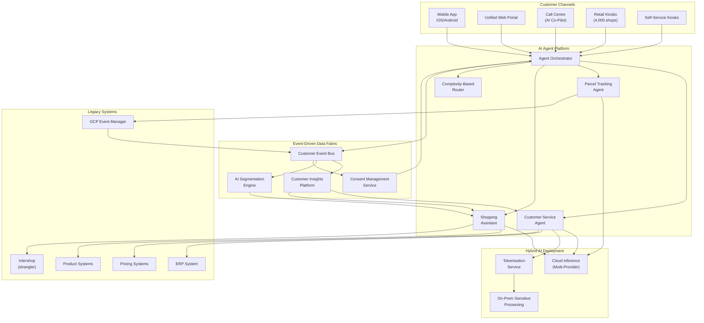
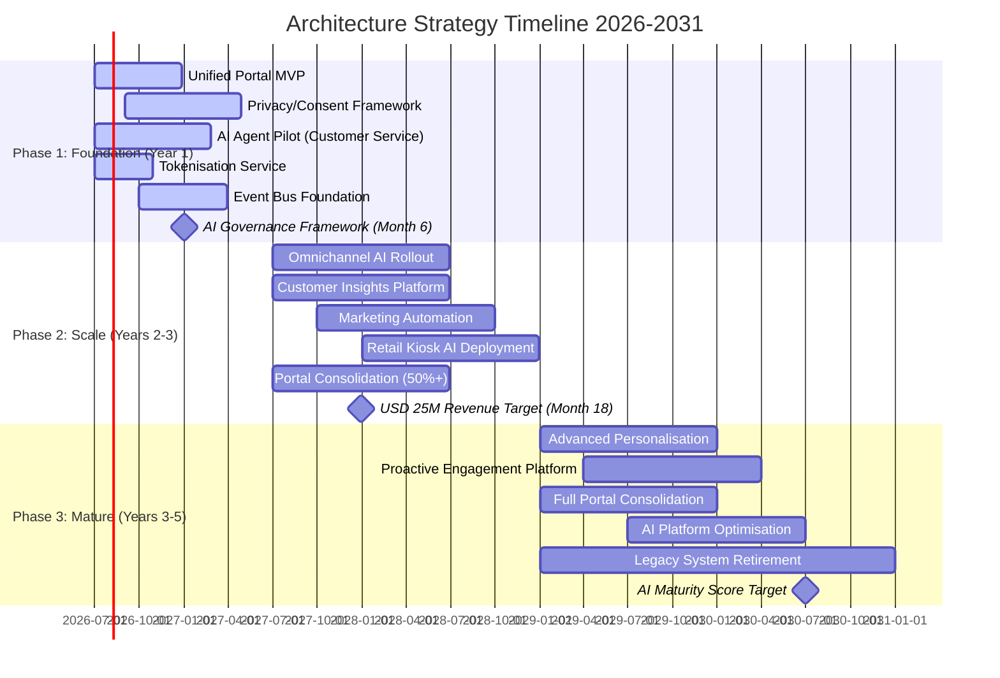

# Architecture Strategy: AgenticEA — MagicDelivery Agent AI Transformation

> **Template Origin**: Official | **ArcKit Version**: 5.15.2 | **Command**: `/arckit:strategy`

## Document Control

| Field | Value |
|-------|-------|
| **Document ID** | ARC-001-STRAT-v1.0 |
| **Document Type** | Architecture Strategy (STRAT) |
| **Project** | 001 — AgenticEA: Agent AI Transformation |
| **Classification** | OFFICIAL |
| **Status** | DRAFT |
| **Version** | 1.0 |
| **Created Date** | 2026-07-01 |
| **Last Modified** | 2026-07-01 |
| **Review Cycle** | Quarterly |
| **Next Review Date** | 2026-10-01 |
| **Owner** | Programme Director |
| **Reviewed By** | PENDING |
| **Approved By** | PENDING |
| **Distribution** | Executive Leadership, Parcel Business, Digital Technology, Compliance/Legal, Program Delivery Team, Enterprise Architecture Review Board |

## Revision History

| Version | Date | Author | Changes | Approved By | Approval Date |
|---------|------|--------|---------|-------------|---------------|
| 1.0 | 2026-07-01 | ArcKit AI | Initial creation from `/arckit:strategy` command — architecture strategy for MagicDelivery Agent AI Transformation with current/target state analysis, 6 strategic themes, 5-year phased roadmap | PENDING | PENDING |

---

## Executive Summary

### Strategic Vision

MagicDelivery is embarking on a fundamental transformation from legacy, siloed digital operations to an AI-augmented, composable enterprise architecture. This strategy defines the architectural journey from 20 fragmented customer portals and disconnected systems to an omnichannel AI agent platform that serves 10 million customers across mobile, web, call centre, retail, and self-service touchpoints.

The transformation is organised into three horizons over five years: **Foundation** (Year 1) establishing unified portal, privacy framework, and AI pilot capabilities; **Scale** (Years 2–3) rolling out omnichannel AI agents, customer insights, and marketing automation; and **Mature** (Years 3–5) achieving full AI-augmented experience with proactive engagement and advanced personalisation. Success is measured by USD 25M incremental annual revenue by Month 18, 40% routine call deflection, NPS improvement from 32 to 42, and zero Privacy Act breaches.

This strategy is grounded in 17 enterprise architecture principles (ARC-000-PRIN-v2.0), informed by 9 stakeholder groups and 12 drivers (ARC-001-STKE-v1.0), constrained by 8 business and 59 technical requirements (ARC-001-REQ-v1.0), shaped by 8 architecture decisions (ARC-001-ADR-v1.0), and risk-managed against 30 identified risks (ARC-001-RISK-v1.0).

### Strategic Context

| Aspect | Summary |
|--------|---------|
| **Business Challenge** | 20+ isolated customer portals, fragmented privacy management, no cross-channel customer insights, reactive-only engagement model, legacy Intershop e-commerce platform |
| **Strategic Opportunity** | AI-augmented omnichannel experience delivering USD 25M incremental revenue and USD 15M annual operational savings; 3.5x ROI within 24 months |
| **Investment Horizon** | 5 years, USD 18.5M approved programme budget (Years 1–3 detail), USD 11.5M TCO for hybrid AI deployment (ADR-001) |
| **Expected ROI** | 3.5x by Month 24 (BR-001, BR-005) |
| **Risk Appetite** | Medium — 38% inherent risk reduction achieved through controls; 8 risks remain above appetite requiring active treatment |

### Key Strategic Decisions

| Decision | Choice | Rationale |
|----------|--------|-----------|
| **AI Deployment Model** | Hybrid (Cloud Inference + On-Prem Sensitive Data) | APP 8 compliance by design; 59% TCO reduction vs fully on-prem; elastic cloud scaling (ADR-001) |
| **Agent-Human Handoff** | Complexity-Based Routing | 60/40 split aligns with current query distribution; proactive compliance escalation; sub-30-second handoff (ADR-002) |
| **Data Architecture** | Event-Driven Data Fabric | Real-time insights across channels; decouples legacy systems from AI agents; supports 360-degree customer view (ADR-003) |
| **Mobile Integration** | SDK Embedding | Leverages existing 3M MAU base; progressive AI feature rollout; no app-replace risk (ADR-004) |
| **Channel Strategy** | Centralised Agent Backend with Multi-Channel UI | Consistent AI experience across all touchpoints; reusable agent components (ADR-005) |
| **Legacy Modernisation** | Strangler-Fig Pattern | Incremental portal consolidation; zero business disruption; anti-corruption layers (PRIN-17) |

### Strategic Outcomes

1. **AI-Driven Revenue Growth**: USD 25M incremental annual revenue from AI-enabled features by Month 18, measured through feature-attribution modelling against control groups
2. **Customer Experience Transformation**: NPS improvement from 32 to 42 and CSAT above 80% by Month 12, with sub-30-second AI resolution times
3. **Operational Efficiency**: 40% routine call centre deflection (48,000 calls per month) delivering USD 15M annual savings with zero net FTE reduction
4. **Privacy-Compliant AI Architecture**: Zero Privacy Act breaches; 100% DPIA completion; APP 8 compliance by design
5. **Scalable AI Platform**: Production-ready platform supporting 50,000 concurrent users, sub-2-second p95 response times, and 2-week agent onboarding cycles

---

## Strategic Drivers

> *Synthesised from: ARC-001-STKE-v1.0*

### Business Drivers

| Driver ID | Driver | Stakeholder | Intensity | Strategic Goal |
|-----------|--------|-------------|-----------|----------------|
| SD-1 | Revenue growth through AI-enabled commerce and personalised offers | Parcel Business GM | CRITICAL | G-1 (AI-Driven Revenue Growth) |
| SD-2 | Scalable AI platform for enterprise reuse | Head of Digital Technology | HIGH | G-5 (Scalable AI Platform Capability) |
| SD-3 | Programme delivery excellence within budget and timeline | Programme Director | HIGH | G-8 (Delivery Excellence and Scope Control) |
| SD-5 | Modernised customer experience with reduced wait times | Head of Customer Experience | CRITICAL | G-2 (Customer Experience Transformation) |
| SD-6 | Seamless, AI-augmented self-service experience | Customers (10M) | CRITICAL | G-2 (Customer Experience Transformation) |
| SD-7 | Workforce augmentation without net job loss | Operations Staff (10,000) | HIGH | G-6 (Workforce Augmentation and Upskilling) |
| SD-8 | Privacy Act compliance and data sovereignty | Privacy Officer / CISO | CRITICAL | G-4 (Privacy-Compliant AI Architecture) |
| SD-9 | Board-mandated AI transformation for competitive positioning | Executive Leadership | CRITICAL | G-7 (Regulatory Readiness for AI Governance) |

### External Drivers

| Driver | Source | Impact | Strategic Response |
|--------|--------|--------|-------------------|
| Privacy Act 1988 and APPs (APP 8 cross-border disclosure) | OAIC | Critical — USD 2.5M penalty per breach | Privacy-by-design; hybrid deployment; tokenisation layer |
| ACCC Consumer Law (misleading AI content) | ACCC | High — consumer harm liability | Response validation engine; authoritative data verification |
| Competitive pressure from Amazon Logistics and dedicated couriers | Market | High — market share erosion | AI-differentiated experience; proactive engagement |
| AI Regulation Review (Treasury) | Government | Medium — future compliance burden | Proactive AI Governance Framework by Month 6 |
| Generative AI model advancement | Technology | High — capabilities evolve quarterly | Multi-vendor strategy; model abstraction layer |
| Fair Work Act obligations | Government | High — workforce impact | AI Augmentation Charter; union consultation framework |

### Stakeholder Alignment

```text
                          INTEREST
              Low                         High
        +-----------------------+-----------------------+
        |                       |                       |
        |   KEEP SATISFIED      |   MANAGE CLOSELY      |
   High |  Retail Staff         |  Executive Leadership |
        |  Community Groups     |  Parcel Business GM    |
        |  Government Regulators|  Privacy Officer       |
        |                       |  Customers (10M)       |
 P      +-----------------------+-----------------------+
 O      |                       |                       |
 W      |      MONITOR          |    KEEP INFORMED       |
 E      |  Shareholders         |  Head of Operations     |
 R Low  |  Media                |  Head of People & Culture
        |  Industry Analysts    |  Programme Director      |
        +-----------------------+-----------------------+
```

---

## Guiding Principles

> *Synthesised from: ARC-000-PRIN-v2.0*

The following architecture principles guide all strategic and design decisions:

### Foundational Principles

| ID | Principle | Statement | Strategic Implication |
|----|-----------|-----------|----------------------|
| P-01 | Business Outcome Alignment | All technology investments MUST be traceable to measurable business outcomes | Every strategic theme maps to revenue growth, cost reduction, risk mitigation, or capability creation |
| P-02 | Composable Architecture | All systems MUST be designed as composable, independently deployable components | AI agents, consent services, and customer profiles as reusable building blocks across channels |
| P-03 | AI-Augmented Operations | All systems SHOULD be designed for AI agent deployment from inception | Agent-ready interfaces; structured data outputs; human-in-the-loop escalation paths |
| P-04 | Security by Design (NON-NEGOTIABLE) | All architectures MUST implement defense-in-depth with zero-trust principles | PII tokenisation; encrypted data flows; continuous access verification |

### Technology Principles

| ID | Principle | Statement | Strategic Implication |
|----|-----------|-----------|----------------------|
| P-05 | Observability and Operational Excellence | All systems MUST emit structured telemetry (logs, metrics, traces) | AI agent performance monitoring; model accuracy tracking; customer experience analytics |
| P-06 | Data as a Product | All data domains MUST be treated as products — owned, governed, maintained | Customer profile as data product; consent data as product; logistics events as product |
| P-07 | Data Sovereignty and Governance | Data classification, residency, retention, and access controls MUST comply with regulatory requirements | On-prem PII processing; international data residency; automated retention policies |

### Governance Principles

| ID | Principle | Statement | Strategic Implication |
|----|-----------|-----------|----------------------|
| P-08 | Loose Coupling | Systems MUST be loosely coupled through published interfaces | Agent platform decoupled from legacy systems; API-first integration |
| P-09 | Event-Driven Integration | Systems SHOULD use event-driven architecture for non-real-time interactions | Customer event bus for real-time insights; async processing for notifications |
| P-10 | Legacy Modernization Strategy | Legacy modernization MUST follow incremental strangler-fig patterns | Strangler portal; anti-corruption layers; incremental AI agent introduction |

### Principles Compliance Summary

| Principle Category | Current Compliance | Target Compliance (Year 5) | Gap |
|-------------------|-------------------|---------------------------|-----|
| Foundational | 35% | 100% | 65% |
| Technology | 25% | 100% | 75% |
| Governance | 20% | 100% | 80% |
| **Overall** | **27%** | **100%** | **73%** |

---

## Current State Assessment

### Technology Landscape

MagicDelivery's current digital architecture is characterised by fragmentation, siloed data, and absence of AI capability across customer touchpoints.

**Key Systems**:

| System | Purpose | Technology | Age | Technical Debt | Strategic Fit |
|--------|---------|------------|-----|----------------|---------------|
| Customer Portal Ecosystem | 20+ isolated UI portals per customer segment | Custom web applications | 8–12 years | HIGH | REPLACE (unified portal programme in progress) |
| Intershop E-Commerce | Online shopping and product catalogue | Intershop Commerce Suite | 6–8 years | HIGH | REPLACE (Year 1–2 strangler migration) |
| ERP | Core business operations, billing, fulfilment | SAP/Oracle | 10–15 years | MEDIUM | RETAIN (API gateway integration) |
| GCP Event Manager | Parcel lifecycle event management (lodgement through tracking) | Custom GCP microservices | 3–4 years | LOW | RETAIN (event bus integration for AI agents) |
| Pricing Systems | Service pricing and fee calculation | Custom | 5–7 years | MEDIUM | RETAIN (authoritative data source for AI agents) |
| Product Systems | Product and service catalogue management | Custom | 4–6 years | MEDIUM | RETAIN (authoritative data source for AI agents) |
| Mobile App (Native) | Parcel tracking, basic customer engagement | Native iOS/Android | 2–3 years | LOW | RETAIN (AI agent embedding via SDK) |
| Call Centre Platform | Customer service interactions | CTI/CRM | 8–10 years | HIGH | RETAIN (AI co-pilot integration) |
| Privacy Management | No enterprise-wide system — each system manages independently | N/A | — | CRITICAL | BUILD (Privacy/Consent Framework — Year 1 priority) |

### Capability Maturity Baseline

| Capability Domain | Current Maturity | Assessment |
|-------------------|------------------|------------|
| **AI Agent Platform** | L1 (Initial) | No AI agent capability exists; no agent orchestration, no model serving, no governance |
| **Omnichannel Integration** | L1 (Initial) | 20+ isolated portals with no unified customer identity; no cross-channel experience management |
| **Customer Data Management** | L2 (Repeatable) | Customer data exists in CRM and ERP but fragmented; no 360-degree view |
| **Privacy & Consent** | L1 (Initial) | No enterprise-wide consent management; each system manages privacy independently |
| **Marketing Intelligence** | L2 (Repeatable) | Basic campaign capability exists; no AI-powered segmentation or real-time personalisation |
| **Real-Time Event Processing** | L3 (Defined) | GCP Event Manager provides parcel lifecycle events; limited consumer access beyond logistics |
| **Mobile Experience** | L3 (Defined) | Functional native app with parcel tracking; ready for AI agent embedding |

**Maturity Levels**: L1 (Initial), L2 (Repeatable), L3 (Defined), L4 (Managed), L5 (Optimised)

### Technical Debt Summary

- **Total Technical Debt**: Estimated 240 person-months to consolidate legacy portals and modernise integration layer
- **High Priority Items**: 4 (portal fragmentation, privacy gap, no AI platform, no event bus)
- **Impact on Delivery**: Legacy portal consolidation must proceed in parallel with AI programme — AI agents depend on unified customer identity and consent framework

### Strengths, Weaknesses, Opportunities, Threats (SWOT)

| Strengths | Weaknesses |
|-----------|------------|
| Existing GCP event infrastructure provides real-time logistics data | 20+ siloed portals create fragmented customer experience |
| Functional mobile app with 3M monthly active users | No enterprise-wide privacy or consent management |
| Established ERP, pricing, and product systems as authoritative data sources | No AI capability across any customer touchpoint |
| 4,000 retail shops provide physical touchpoint network | No cross-channel customer insights or 360-degree view |

| Opportunities | Threats |
|---------------|---------|
| AI agents can achieve 40% call deflection, delivering USD 15M annual savings | Competitive pressure from Amazon Logistics and dedicated couriers |
| Omnichannel AI enables proactive engagement vs current reactive model | Privacy Act compliance risk (R-017) and ACCC consumer law exposure |
| Unified portal programme creates foundation for AI agent deployment | Union opposition (R-013) if AI perceived as workforce replacement |
| Personalisation at scale enables targeted, high-ROI marketing campaigns | AI hallucination (R-001) risking brand reputation and customer trust |

---

## Target State Vision

### Future Architecture

The target architecture is a **composable AI agent platform** that delivers consistent, intelligent customer experiences across all engagement channels. It is built on three architectural pillars:

**Pillar 1: AI Agent Platform** — Centralised agent orchestration with multi-model support (ADR-001 hybrid deployment), agent lifecycle management, model governance (ADR-007), and telemetry/observability. Supports concurrent conversational agents, parcel tracking agents, and shopping assistants with complexity-based human handoff (ADR-002).

**Pillar 2: Composable Customer Experience** — Reusable UI components delivered through SDK embedding (ADR-004) into mobile app, web portal, and channel-specific UIs. Centralised agent backend (ADR-005) ensures consistent AI experience across mobile, web, call centre, retail kiosks, and self-service interfaces.

**Pillar 3: Event-Driven Data Fabric** — Real-time customer event processing (ADR-003) ingesting parcel events, customer interactions, and consent data through a unified event bus. Powers real-time customer insights, 360-degree customer profiles, and AI-powered marketing segmentation.

**Target State Characteristics**:

- **Omnichannel AI Agent Deployment**: AI agents across mobile app, web, call centre, retail, and self-service kiosks with consistent experience
- **Composable Architecture**: Reusable agent components with published interfaces enabling rapid reconfiguration for new channels or capabilities
- **Privacy-First Design**: Enterprise-wide consent management framework with granular controls; APP 8 compliance by design
- **Real-Time Customer Insights**: Marketing team has 360-degree customer view for proactive campaign management and dynamic segmentation
- **AI-Powered Commerce**: Product recommendation, pricing comparison, intelligent parcel tracking, and personal assistant integration
- **Event-Driven Processing**: Real-time event bus for customer journeys, logistics events, and consent lifecycle
- **Proactive Engagement Model**: AI-driven predictive engagement replaces reactive-only current state

### Capability Maturity Targets

| Capability Domain | Current | Target | Gap | Priority |
|-------------------|---------|--------|-----|----------|
| AI Agent Platform | L1 | L4 | +3 | CRITICAL |
| Omnichannel Integration | L1 | L4 | +3 | CRITICAL |
| Customer Data Management | L2 | L4 | +2 | HIGH |
| Privacy & Consent | L1 | L4 | +3 | CRITICAL |
| Marketing Intelligence | L2 | L5 | +3 | HIGH |
| Real-Time Event Processing | L3 | L4 | +1 | MEDIUM |

### Architecture Vision Diagram



---

## Current vs Target State Gap Analysis

### System-Level Gap Analysis

| Current System | Target Architecture | Gap Category | Closure Strategy |
|----------------|-------------------|-------------|------------------|
| 20+ isolated portals | Unified web portal with AI agents | Platform consolidation | Strangler-fig pattern; Year 1–2 |
| No AI agent layer | AI Agent Platform (orchestrator + agents + governance) | Capability creation | Greenfield build; Year 1 pilot |
| No privacy/consent management | Enterprise-wide Consent Management Service | Capability creation | Greenfield build; Year 1 priority |
| No cross-channel insights | Customer Insights Platform with 360-degree view | Capability creation | Event-driven data fabric; Year 2 |
| No AI marketing | AI Segmentation Engine + dynamic campaigns | Capability creation | Built on insights platform; Year 2–3 |
| Intershop (legacy) | Composable commerce with AI shopping assistant | Modernisation | Strangler-fig pattern; Year 1–3 |
| GCP Event Manager (logistics only) | Unified Customer Event Bus | Capability extension | Event bus integration; Year 1–2 |
| Mobile App (tracking only) | Mobile App with AI agent SDK embedding | Capability extension | SDK integration; Year 1 pilot |
| Call centre (manual) | Call centre with AI co-pilot and complexity routing | Capability extension | AI co-pilot integration; Year 1–2 |
| Retail shops (limited digital) | Retail kiosks with AI agent UI | Capability extension | Kiosk deployment; Year 2–3 |

### Capability Gap Mapping

| Capability | Current State | Target State | Gap Description | Closure Timeline |
|------------|--------------|-------------|-----------------|------------------|
| **Unified Customer Identity** | No cross-system identity | Federated identity across all channels | Single sign-on and identity resolution needed | Year 1 |
| **Consent Management** | Per-system, no coordination | Enterprise-wide granular consent | Centralised consent service with opt-in/out management | Year 1 |
| **AI Agent Orchestration** | None | Multi-agent orchestration with human handoff | Agent platform, model serving, complexity routing | Year 1–2 |
| **Real-Time Customer Insights** | None | 360-degree view with event-driven processing | Customer data platform with real-time analytics | Year 2 |
| **AI-Powered Personalisation** | None | Dynamic segmentation and proactive offers | ML-based segmentation engine with campaign automation | Year 2–3 |
| **Omnichannel Experience** | 20+ siloed portals | Consistent experience across 5 channels | Composable UI with channel-specific SDKs | Year 1–3 |
| **Proactive Engagement** | Reactive-only | Predictive, AI-driven customer engagement | Event-driven triggers with AI-generated engagement | Year 3–5 |

### Technology Gap Identification

| Gap Area | Current State | Required Capability | Technology Approach |
|----------|--------------|---------------------|---------------------|
| Model Serving | None | Hybrid cloud/on-prem model serving | ADR-001 hybrid deployment; multi-provider abstraction |
| Tokenisation | None | PII tokenisation before cloud transmission | Cryptographic tokenisation service; HashiCorp Vault |
| Event Bus | GCP events (logistics only) | Enterprise-wide customer event bus | Apache Kafka/Pub-Sub; event schema registry |
| Customer Data Platform | CRM (fragmented) | Unified customer profile store | Data lakehouse; customer data product |
| Consent Management | None | Granular consent with lifecycle management | Greenfield consent service; privacy dashboard |
| Agent Governance | None | Model governance, compliance, monitoring | ADR-007 hybrid governance framework |
| AI Co-Pilot | None | Staff AI assistant for call centre and retail | Conversational AI with CRM integration |

---

## Technology Evolution Strategy

### Strategic Positioning

| Component | Current Position | Target Position | Evolution Strategy |
|-----------|------------------|-----------------|-------------------|
| AI Agent Platform | Genesis | Custom Build | Innovate in-house; core differentiator |
| Tokenisation Service | Genesis | Custom Build | Security-critical; internal capability |
| Cloud Model Inference | Product | Commodity | Consume via managed services; multi-provider |
| Event Bus Infrastructure | Product | Utility | Consume cloud-native messaging services |
| Customer Data Platform | Custom Build | Product | Evolve from data lakehouse to managed service |
| Consent Management | Genesis | Custom Build | Internal capability; regulatory necessity |
| Mobile SDK | Custom Build | Product | Reusable across MagicDelivery digital properties |
| Legacy Portals (20+) | Custom Build | Retire | Strangler-fig elimination over 5 years |

### Build vs Buy Decisions

| Capability | Decision | Rationale | Timeline |
|------------|----------|-----------|----------|
| AI Agent Orchestration | BUILD | Core differentiator; no market product matches MagicDelivery domain | Year 1–2 |
| Model Serving Layer | HYBRID | Cloud inference (buy) + tokenisation (build) per ADR-001 | Year 1 |
| Event Bus | BUY | Mature cloud-native messaging; no build advantage | Year 1–2 |
| Consent Management | BUILD | Regulatory necessity; domain-specific requirements | Year 1 |
| Customer Data Platform | HYBRID | Data lakehouse (buy) + customer profile logic (build) | Year 2 |
| Mobile SDK | BUILD | Reusable internal asset; domain-specific AI integration | Year 1–2 |
| Marketing Automation | BUY | Mature market (Year 2–3); build on insights platform | Year 2–3 |
| Analytics & Insights | HYBRID | Cloud analytics (buy) + customer profiling (build) | Year 2 |

### Technology Radar Summary

| Ring | Technologies |
|------|-------------|
| **Adopt** (Use now) | Hybrid AI inference (ADR-001), Event-driven architecture, SDK embedding pattern, Strangler-fig modernisation |
| **Trial** (Evaluate) | Vector databases for AI retrieval, Real-time stream processing frameworks, Multi-agent orchestration frameworks |
| **Assess** (Watch) | Federated learning for privacy-preserving AI, WebAssembly edge computing for mobile AI, Quantum-resistant tokenisation |
| **Hold** (Avoid) | Monolithic portal replacement (big-bang), Vendor-locked proprietary AI platforms, On-prem-only model serving (prohibitive CAPEX per ADR-001) |

---

## Strategic Themes & Investment Areas

### Theme 1: AI Agent Platform Foundation

**Strategic Objective**: Establish production-ready AI agent platform supporting hybrid deployment model, enabling customer service, parcel tracking, and shopping assistant agents with measurable deflection and resolution outcomes.

**Investment**: USD 8.5M over 2 years (46% of total programme budget)

**Key Initiatives**:

1. **AI Agent Platform Core**: Agent orchestrator, model serving abstraction, multi-provider integration, observability and telemetry
2. **Hybrid Deployment Pipeline**: Tokenisation service (ADR-001), cloud inference layer, on-prem sensitive processing, circuit breaker patterns
3. **AI Agent Pilot — Customer Service**: Conversational agent for common queries (parcel tracking, delivery status, fees), complexity-based routing (ADR-002)
4. **AI Governance Framework**: Model registry, compliance monitoring, DPIA automation, hallucination detection (FR-016)
5. **Human-in-the-Loop Escalation**: Seamless handoff to human agents, full context transfer, skill-based routing

**Success Criteria**:

- [ ] AI agent pilot achieves 85% first-contact resolution rate on routine queries
- [ ] Platform supports 50,000 concurrent users with sub-2-second p95 response
- [ ] Zero Privacy Act breaches in AI operations
- [ ] AI Governance Framework achieves maturity score of 7/10
- [ ] Cost per AI interaction below USD 0.05

**Principles Alignment**: P-01 (Business Outcome), P-02 (Composable), P-03 (AI-Augmented), P-04 (Security by Design)

---

### Theme 2: Unified Customer Experience

**Strategic Objective**: Consolidate 20+ isolated portals into a unified customer experience platform with AI agents embedded across all channels, delivering consistent omnichannel engagement.

**Investment**: USD 4.5M over 3 years (24% of total programme budget)

**Key Initiatives**:

1. **Unified Portal Consolidation**: Strangler-fig migration from 20+ portals to single web portal; API gateway integration
2. **Mobile App AI Integration**: SDK embedding (ADR-004) for AI agent capabilities within existing mobile app
3. **Omnichannel UI Component Library**: Reusable agent UI components for web, mobile, retail kiosks, and self-service
4. **Customer Identity Unification**: Federated identity across all channels; single sign-on; customer profile resolution
5. **4,000 Retail Shop Digital Integration**: AI agent-enabled kiosks with staff AI co-pilot (ADR-006)

**Success Criteria**:

- [ ] Unified portal serving 80% of portal traffic by end of Year 2
- [ ] Mobile app AI agent adoption above 20% of monthly active users by Month 6
- [ ] Consistent AI experience rating above 4.0/5.0 across all channels
- [ ] Zero customer-facing service disruption during portal migration
- [ ] Retail AI kiosk deployment in top 500 shops by Year 3

**Principles Alignment**: P-02 (Composable), P-05 (Observability), P-08 (Loose Coupling), P-10 (Legacy Modernization)

---

### Theme 3: Privacy-First Architecture

**Strategic Objective**: Establish enterprise-wide consent and privacy management framework that enables AI agent operations while achieving zero Privacy Act breaches and full APP compliance.

**Investment**: USD 2.5M over 1 year (14% of total programme budget)

**Key Initiatives**:

1. **Consent Management Service**: Enterprise-wide consent framework with granular opt-in/opt-out controls; privacy dashboard for customers
2. **Data Protection by Design**: Automated DPIA workflows, data minimisation enforcement, consent-aware AI agent operations
3. **Tokenisation and Data Sovereignty**: PII tokenisation layer (ADR-001), international data residency enforcement, automated retention policies
4. **Compliance Governance Framework**: Hybrid compliance model (ADR-007) — pre-deployment DPIAs plus runtime privacy monitoring
5. **Privacy-Compliant AI Training**: Data isolation for AI model training; synthetic data generation where feasible

**Success Criteria**:

- [ ] Zero Privacy Act breaches attributable to AI operations
- [ ] 100% DPIA completion rate before feature launch
- [ ] Privacy complaints below 5 per 100,000 AI interactions
- [ ] Automated privacy controls covering all data collection points
- [ ] Customer trust score above 85% in annual privacy survey

**Principles Alignment**: P-04 (Security by Design), P-07 (Data Sovereignty), P-03 (AI-Augmented Operations — privacy-compliant AI)

---

### Theme 4: Real-Time Customer Insights

**Strategic Objective**: Transform from reactive, siloed customer data to real-time, event-driven customer insights enabling proactive engagement and AI-powered decision making.

**Investment**: USD 2.0M over 2 years (11% of total programme budget)

**Key Initiatives**:

1. **Customer Event Bus**: Enterprise-wide event bus (ADR-003) ingesting parcel events, customer interactions, consent data, and marketing touchpoints
2. **Customer Data Platform**: Unified customer profile store with 360-degree view; real-time enrichment from event stream
3. **Marketing Intelligence Platform**: AI-powered customer segmentation, dynamic campaign management, real-time personalisation
4. **Analytics and Telemetry**: AI agent performance dashboards, customer journey analytics, campaign attribution modelling
5. **Predictive Engagement Engine**: ML-driven predictive triggers for proactive customer engagement

**Success Criteria**:

- [ ] 360-degree customer view covering 80% of customer base by Year 2
- [ ] Real-time event processing latency under 60 seconds
- [ ] Marketing campaign ROI improvement of 50% through AI segmentation
- [ ] Customer insight coverage above 90% of active customers by Year 3
- [ ] Predictive engagement conversion rate above 15%

**Principles Alignment**: P-06 (Data as a Product), P-09 (Event-Driven Integration), P-01 (Business Outcome Alignment)

---

### Theme 5: Marketing Intelligence & Proactive Engagement

**Strategic Objective**: Transition from reactive customer engagement to AI-powered, proactive marketing with dynamic, nibble-sized campaigns driven by real-time customer insights.

**Investment**: USD 1.0M over 3 years (5% of total programme budget)

**Key Initiatives**:

1. **AI-Powered Customer Segmentation**: Real-time behavioural segmentation using event-driven data; micro-segmentation for targeted offers
2. **Dynamic Campaign Engine**: Nibble-sized, high-frequency campaigns triggered by real-time customer events and AI predictions
3. **Personalisation Engine**: Opt-in personalisation based on customer history, preferences, and real-time context (FR-005)
4. **Revenue Attribution Modelling**: Feature-attribution tracking for AI-enabled revenue measurement against control groups
5. **Proactive Engagement Automation**: AI-driven engagement triggers for delivery updates, service offers, and loyalty programmes

**Success Criteria**:

- [ ] AI-attributed incremental revenue reaching USD 25M annual run-rate by Month 18
- [ ] Customer acquisition rate from AI-driven onboarding above 5% of MAU
- [ ] Average order value uplift of 10% for AI-engaged customers
- [ ] Proactive engagement response rate above 20%
- [ ] Campaign automation reducing manual campaign effort by 70%

**Principles Alignment**: P-01 (Business Outcome), P-03 (AI-Augmented Operations), P-06 (Data as a Product)

---

### Theme 6: Omnichannel Composable Architecture

**Strategic Objective**: Build a composable, channel-agnostic architecture enabling consistent AI experiences across all customer touchpoints with independently deployable components.

**Investment**: USD 0.5M over 3 years (2% of total programme budget — foundational work absorbed in Theme 1–2)

**Key Initiatives**:

1. **API-First Architecture**: Published API contracts for all agent interfaces; versioned interfaces with backward compatibility
2. **Component Decomposition**: Agent components mapped to business capabilities; independent deployment pipelines
3. **Multi-Channel UI Framework**: Channel-agnostic agent UI with channel-specific rendering; SDK distribution model
4. **Integration Architecture**: API gateway, service mesh, and integration patterns supporting legacy system access without tight coupling
5. **Architecture Guardrails**: Automated compliance checking against 17 enterprise principles; architecture review gates

**Success Criteria**:

- [ ] 100% of agent components independently deployable
- [ ] Zero shared databases across component boundaries
- [ ] API contract versioning with zero breaking changes
- [ ] New channel onboarding time under 4 weeks
- [ ] Architecture principles compliance above 90% by Year 3

**Principles Alignment**: P-02 (Composable Architecture), P-08 (Loose Coupling), P-10 (Legacy Modernization Strategy)

---

## Delivery Roadmap Summary

### Strategic Timeline



### Phase Summary

| Phase | Timeline | Focus | Investment | Key Deliverables |
|-------|----------|-------|------------|------------------|
| **Foundation** | 2026-07 to 2027-06 | AI platform, privacy framework, unified portal pilot, AI agent pilot | USD 8.5M | AI agent pilot live; consent framework operational; portal MVP; event bus foundation |
| **Scale** | 2027-07 to 2029-06 | Omnichannel rollout, customer insights, marketing automation, retail AI | USD 6.5M | Omnichannel AI agents; insights platform; automated campaigns; 500 retail kiosks |
| **Mature** | 2029-07 to 2031-06 | Advanced personalisation, proactive engagement, full consolidation, AI maturity | USD 3.5M | Full AI-augmented experience; legacy retirement; optimised AI platform |

### Key Milestones

| Milestone | Date | Theme | Gate |
|-----------|------|-------|------|
| Strategy Approved | 2026-07-01 | Foundation | Strategy Gate |
| Tokenisation Service Operational | 2026-10-01 | Theme 1, 3 | Alpha |
| AI Agent Pilot Live (Customer Service) | 2026-12-31 | Theme 1 | Alpha |
| Privacy/Consent Framework Operational | 2027-03-31 | Theme 3 | Beta |
| Unified Portal MVP | 2027-01-15 | Theme 2 | Beta |
| Omnichannel AI Rollout Begins | 2027-07-01 | Theme 2, 6 | Beta |
| Customer Insights Platform Live | 2028-06-30 | Theme 4 | Gamma |
| USD 25M Revenue Target Achieved | 2027-12-31 | Theme 5 | Business Milestone |
| AI Maturity Score 7/10 | 2030-06-30 | All | Live |
| Full Legacy Retirement | 2031-06-30 | Theme 2, 6 | Closeout |

---

## Investment Summary

| Item | Value |
|------|-------|
| **Total Investment Envelope** | USD 18.5M over 5 years (approved programme budget per REQ) |
| **Investment Horizon** | 2026 – 2031 |
| **CAPEX / OPEX Split** | 22% CAPEX / 78% OPEX |
| **Hybrid AI Deployment TCO** | USD 11.5M over 3 years (ADR-001: USD 2.5M CAPEX + USD 3.0M/year OPEX) |

> Detailed NPV, IRR, BCR, benefits realisation, and year-by-year investment breakdowns are maintained in the Strategic Outline Business Case. Run `/arckit:sobc` to generate or update the financial case.

---

## Strategic Risks & Mitigations

> *Synthesised from: ARC-001-RISK-v1.0*

### Top Strategic Risks

| Risk ID | Risk Description | Impact | Probability | Mitigation Strategy | Owner |
|---------|------------------|--------|-------------|---------------------|-------|
| R-013 | Union Industrial Action from AI Workforce Impact | Critical | Likely (4) | AI Augmentation Charter; TWU consultation framework; zero net FTE commitment | Head of People & Culture |
| R-017 | Privacy Act Breach from AI Data Processing | Critical | Likely (4) | Privacy-by-design architecture; hybrid deployment (ADR-001); DPIA automation | Privacy Officer |
| R-023 | Customer Data Exposure Through AI Model Training | Critical | Likely (4) | Data isolation for training; synthetic data; tokenisation (ADR-001) | CISO |
| R-001 | AI Hallucination in Customer-Facing Responses | High | Likely (4) | Response validation engine; confidence thresholding (70%); authoritative data verification | Head of Digital Technology |
| R-011 | Brand Reputation Damage from AI Errors | High | Almost Certain (5) | Incident response playbooks; brand protection framework; rapid remediation | CEO |
| R-018 | ACCC Consumer Law Breach from AI Content | High | Likely (4) | Legal review gates; content validation; compliance-by-design AI responses | Legal Counsel |
| R-022 | Prompt Injection Attacks on AI Agents | High | Likely (4) | Input validation; prompt hardening; adversarial testing; rate limiting | CISO |
| R-002 | AI Model Vendor Lock-In | High | Likely (4) | Multi-vendor strategy; abstraction layer; SLA-based contracts | Head of Digital Technology |

### Risk Heat Map

```text
                    PROBABILITY
              Low         Medium        High
        +------------+------------+------------+
        |            |            |            |
   High |            |   R-002    |   R-001    |
        |            |  (Vendor   | (Halluci-  |
        |            |   Lock-In) |  nation)   |
 I      +------------+------------+------------+
 M      |            |            |            |
 P Medium|           |   R-011    |   R-018    |
 A      |            | (Brand     |  (ACCC     |
 C      |            |  Damage)   |  Breach)    |
 T      +------------+------------+------------+
   Low  |            |            |            |
        |            |  R-022     |            |
        |            |(Injection) |            |
        +------------+------------+------------+

  Critical Risks (separate axis):
  R-013: Union Action ████████████ (Score 20 — residual 20)
  R-017: Privacy Breach ██████████ (Score 20 — residual 16)
  R-023: Data Exposure ██████████ (Score 20 — residual 16)
```

### Assumptions & Constraints

**Critical Assumptions**:

1. Portal consolidation programme proceeds on schedule — AI agent deployment depends on unified customer identity
2. Funding will be approved as per USD 18.5M approved programme budget
3. Key AI engineering skills can be recruited or upskilled (2,000 staff upskilling target)
4. Cloud AI model providers will maintain service availability in international regions
5. Union consultation framework achieves agreement before Year 1 pilot production rollout
6. Customer authentication via existing MagicDelivery account system is reliable

**Constraints**:

1. Budget capped at USD 18.5M for 12–24 month core programme; total 5-year transformation may exceed
2. Must achieve AI Governance Framework by Month 6 per BR-007
3. Cannot disrupt active MagicDelivery customer services during migration — zero customer impact requirement
4. Privacy Act 1988 compliance mandatory from Day 1 — no exceptions for pilot or beta
5. Zero net FTE reduction per Board-approved AI Augmentation Charter
6. All customer PII must remain within international data centres (NFR-C-001)

---

## Success Metrics & KPIs

### Strategic KPIs

| KPI | Baseline | Year 1 Target | Years 2–3 Target | Years 3–5 Target | Measurement |
|-----|----------|---------------|-------------------|-------------------|-------------|
| **AI Agent Resolution Rate** | 0% | 70% (pilot) | 85% | 90%+ | First-contact resolution rate on routine queries |
| **Call Deflection Rate** | 0% | 20% (pilot channels) | 40% (target) | 45%+ | Routine queries handled by AI vs human |
| **CSAT Score** | 72% (estimated) | 78% (AI pilot) | 80%+ | 85%+ | Post-interaction customer satisfaction survey |
| **NPS** | 32 | 36 | 42 | 45+ | Quarterly NPS survey |
| **Incremental AI Revenue** | USD 0 | USD 5M | USD 25M | USD 35M+ | Feature-attribution modelling vs control groups |
| **Privacy Compliance** | No framework | 100% DPIA completion | Zero breaches | Zero breaches | DPIA completion rate; OAIC audit findings |
| **Customer Insight Coverage** | 0% | 30% | 80% | 90%+ | Percentage of customers with 360-degree profile |
| **Platform Availability** | N/A | 99.5% (pilot) | 99.9% | 99.95%+ | AI platform uptime monitoring |
| **Staff AI Confidence** | 3.0/10 | 4.5/10 | 6.5/10 | 7.5/10 | Staff survey on AI tool confidence |
| **Legacy Portal Retirement** | 0% | 15% | 60% | 95%+ | Portals retired via strangler pattern |

### Leading Indicators (Early Warning)

| Indicator | Threshold | Action |
|-----------|-----------|--------|
| AI hallucination rate > 5% | Pause deployment; expand validation rules | AI Engineering |
| Privacy complaint rate > 3/100K | Halt data processing; investigate | Privacy Officer |
| Staff AI resistance score > 7/10 | Accelerate upskilling programme | Head of People & Culture |
| AI platform latency p95 > 3s | Scale infrastructure; optimise model serving | Head of Digital Technology |

### Lagging Indicators (Final Proof)

| Indicator | Target | Measurement Period |
|-----------|--------|--------------------|
| ROI on AI investment | 3.5x | 24 months |
| USD 25M annual revenue run-rate | USD 25M | Month 18 |
| NPS improvement to 42+ | NPS 42 | Month 12 |
| AI Governance maturity 7/10 | Maturity 7 | Month 6 |

---

## Governance Model

### Governance Structure

| Forum | Frequency | Participants | Decision Rights |
|-------|-----------|--------------|-----------------|
| **Executive Steering Committee** | Monthly | CEO, Parcel Business GM, Head of Digital Technology, Programme Director, Privacy Officer | Strategic direction; budget approval; risk escalation |
| **AI Governance Board** | Bi-weekly | CISO, Privacy Officer, Head of Digital Technology, AI Engineering Lead, Legal Counsel | AI model approval; compliance decisions; incident response |
| **Architecture Review Board** | Monthly | Enterprise Architects, Head of Digital Technology, Programme Director | Architecture compliance; ADR approval; exception handling |
| **Product Delivery Squad** | Weekly (stand-ups) | Product Owner, Engineering Leads, UX, QA, Data Scientists | Sprint delivery; requirement prioritisation; technical decisions |
| **Union Consultation Forum** | Monthly | Head of People & Culture, TWU Representatives, Operations Staff Reps, Programme Director | Workforce impact review; augmentation charter compliance |

### Decision Rights

| Decision Type | Decision Owner | Consulted | Informed |
|---------------|---------------|-----------|----------|
| AI model selection and deployment | Head of Digital Technology | CISO, Privacy Officer | Executive Steering Committee |
| Architecture principle exceptions | Architecture Review Board | Head of Digital Technology | Enterprise Architects |
| Customer data processing decisions | Privacy Officer | CISO, AI Engineering Lead | Legal Counsel |
| Budget reallocation > 10% | Executive Steering Committee | Programme Director | Finance |
| Workforce impact decisions | Head of People & Culture | TWU Representatives, Operations Staff | Executive Leadership |

### Review Cadence

| Review | Frequency | Scope |
|--------|-----------|-------|
| **Architecture Compliance** | Quarterly | All 17 principles assessed against current architecture |
| **Risk Review** | Quarterly | 30 risks reviewed; residual scoring; new risks identified |
| **Benefits Realisation** | Monthly | KPI tracking against 10 strategic metrics |
| **AI Model Performance** | Weekly | Accuracy, hallucination rate, deflection rate, CSAT |
| **Privacy Audit** | Monthly | DPIA status, consent framework effectiveness, compliance metrics |

---

## Traceability

### Source Document Registry

| Document | ID | Type | Role in Strategy |
|----------|----|------|------------------|
| Architecture Principles | ARC-000-PRIN-v2.0 | PRIN | Guiding principles; decision framework; technology standards |
| Stakeholder Analysis | ARC-001-STKE-v1.0 | STKE | Stakeholder drivers; goals; outcomes; engagement strategy |
| Requirements | ARC-001-REQ-v1.0 | REQ | Business, functional, NFR, integration, data requirements |
| Architecture Decisions | ARC-001-ADR-v1.0 | ADR | 8 key architecture decisions with rationale |
| Risk Register | ARC-001-RISK-v1.0 | RISK | 30 risks; mitigations; residual risk assessment |

### Traceability Matrix

| Driver | Goal | Outcome | Theme | Principle | KPI |
|--------|------|---------|-------|-----------|-----|
| SD-1 (Revenue Growth) | G-1 | USD 25M incremental revenue | Theme 5, Theme 1 | P-01 | AI Revenue KPI |
| SD-5 (Modernised CX) | G-2 | NPS 32 → 42; CSAT 80%+ | Theme 1, Theme 2 | P-01, P-02 | NPS/CSAT KPIs |
| SD-7 (Operational Efficiency) | G-3 | 40% call deflection; USD 15M savings | Theme 1, Theme 6 | P-02, P-08 | Deflection Rate KPI |
| SD-8 (Privacy Compliance) | G-4 | Zero Privacy Act breaches | Theme 3 | P-04, P-07 | Privacy Compliance KPI |
| SD-2 (Scalable Platform) | G-5 | 50K concurrent; sub-2s p95 | Theme 1, Theme 6 | P-02, P-05 | Platform Availability KPI |
| SD-7 (Workforce) | G-6 | 2,000 staff upskilled | Theme 2 | P-03 | Staff AI Confidence KPI |
| SD-9 (Governance) | G-7 | AI Governance 7/10 | Theme 1 | P-04 | Governance Maturity KPI |
| SD-3 (Delivery) | G-8 | Within 10% budget; timeline | All Themes | P-01 | Budget Variance KPI |

---

## Next Steps & Recommendations

### Immediate Actions (30 Days)

1. **Secure Architecture Strategy approval** — Present to Executive Steering Committee and Architecture Review Board for formal acceptance
2. **Initiate Tokenisation Service design** — Begin 4-week design sprint per ADR-001 implementation plan (Phase 1)
3. **Establish AI Governance Board** — Charter the board; schedule bi-weekly meetings; define decision rights
4. **Launch Union Consultation Framework** — Engage TWU Representatives; begin AI Augmentation Charter co-development
5. **Confirm Cloud Provider Engagement** — Finalise enterprise agreements with at least 2 AI model providers

### Short-Term Actions (90 Days)

1. **Complete AI Agent Pilot design** — Detailed architecture for customer service agent with human-in-the-loop escalation
2. **Begin Privacy/Consent Framework development** — 8-week design and development sprint
3. **Kick off Unified Portal MVP** — Strangler-fig wrapper for top 5 highest-traffic customer portals
4. **Stand up Event Bus Foundation** — Deploy customer event infrastructure; integrate GCP Event Manager
5. **Recruit and onboard AI Engineering Team** — Target 15 engineers, 3 data scientists, 1 AI platform architect

### Recommended Follow-on Artefacts

| Artefact | ArcKit Command | Priority | Dependent On |
|----------|---------------|----------|-------------|
| Architecture Roadmap | `/arckit:roadmap` | HIGH | This strategy document |
| High-Level Design | `/arckit:diagram` | HIGH | ADRs and strategy |
| Strategic Outline Business Case | `/arckit:sobc` | HIGH | Requirements and strategy |
| Detailed Technical Design | `/arckit:hldr` | MEDIUM | High-level design |
| Data Architecture Design | `/arckit:data` | MEDIUM | Event bus architecture |
| Security Architecture | `/arckit:secd` | HIGH | Hybrid deployment (ADR-001) |
| MLOps Strategy | `/arckit:mlops` | MEDIUM | AI Agent Platform |

---

## Appendix: Architecture Strategy Quality Verification

### STRAT Quality Checklist

| Check | Status |
|-------|--------|
| Current state and target state architecture defined | ✅ — Section: Current State Assessment (technology landscape, maturity baseline) and Target State Vision (future architecture, maturity targets) |
| Gap analysis between current and target states | ✅ — Section: Current vs Target State Gap Analysis (system-level, capability, technology) |
| Recommended approach with rationale and alternatives considered | ✅ — Section: Technology Evolution Strategy (strategic positioning, build vs buy with rationale) |

### Common Quality Checklist

| Check | Status |
|-------|--------|
| Document ID: ARC-001-STRAT-v1.0 | ✅ |
| All 14 Document Control fields populated | ✅ |
| No placeholders | ✅ |
| Classification: OFFICIAL | ✅ |
| Status: DRAFT | ✅ |
| Clean Markdown | ✅ |
| Proper heading hierarchy | ✅ |
| Revision History present | ✅ |
| Generation footer present | ✅ |

---

**Generated by**: ArcKit `/arckit:strategy` command
**Generated on**: 2026-07-01
**ArcKit Version**: 5.15.2
**Project**: 001 — AgenticEA: Agent AI Transformation (MagicDelivery Agent AI Transformation)
**AI Model**: Qwen3.6-27B
**Generation Context**: Synthesised from ARC-000-PRIN-v2.0 (17 principles), ARC-001-STKE-v1.0 (9 stakeholder groups, 12 drivers), ARC-001-REQ-v1.0 (8 business, 59 technical requirements), ARC-001-ADR-v1.0 (8 architecture decisions), ARC-001-RISK-v1.0 (30 risks). Strategy defines 6 strategic themes, 5-year phased roadmap, current/target state analysis, and investment priorities for MagicDelivery AI transformation.
