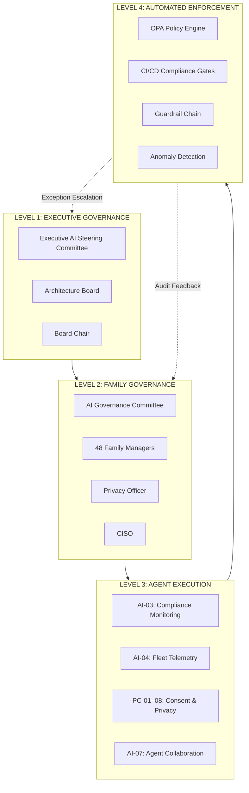

# Agent Governance: AgenticEA — MagicDelivery Agent AI Transformation (v2.0)

> **Template Origin**: Official | **ArcKit Version**: 5.15.2 | **Command**: `/arckit:agent-governance`

## Document Control

| Field | Value |
|-------|-------|
| **Document ID** | ARC-002-AGT-GOV-v2.0 |
| **Document Type** | Agent Governance (AGT-GOV) |
| **Project** | 001 — AgenticEA: Agent AI Transformation |
| **Classification** | OFFICIAL |
| **Status** | DRAFT |
| **Version** | 2.0 |
| **Created Date** | 2026-07-02 |
| **Last Modified** | 2026-07-02 |
| **Review Cycle** | Quarterly |
| **Next Review Date** | 2026-10-02 |
| **Owner** | AI Engineering Lead, Digital Technology |
| **Reviewed By** | PENDING |
| **Approved By** | PENDING |
| **Distribution** | Executive Leadership, Parcel Business, Digital Technology, Compliance/Legal, Program Delivery Team, Privacy Officer / CISO, Enterprise Architecture Review Board, Regional Edge Node Operators |

## Revision History

| Version | Date | Author | Changes | Approved By | Approval Date |
|---------|------|--------|---------|-------------|---------------|
| 1.0 | 2026-07-01 | ArcKit AI | Initial creation — Agent governance framework for 16 agents across 8 categories: lifecycle governance, decision rights, compliance gates, SLA monitoring, incident response, safety guardrails, output validation, human-in-the-loop escalation, behavior monitoring, audit trails, privacy-by-design, real-time dashboards, automated compliance, feedback integration | PENDING | PENDING |
| 2.0 | 2026-07-02 | ArcKit AI | **Major increment:** 16 → 1000 agents scaled via 48 Agent Family model; Family-level governance replaces per-agent oversight; automated compliance gates in CI/CD pipeline; batch lifecycle management (create/upgrade/retire entire families); real-time portfolio monitoring dashboard for 1000-agent fleet; governance maturity model (L0 → L5) for continuous improvement; hierarchical oversight (Global → Regional → Family); automated risk scoring per Family; compliance-as-code enforcement | PENDING | PENDING |

---

## Executive Summary

### Purpose

This Agent Governance (AGT-GOV v2.0) document establishes the authoritative **governance framework, oversight model, compliance automation, and accountability structures** for all 1000 AI agents operating across **48 Agent Families** within the **AgenticEA — MagicDelivery Agent AI Transformation** programme. v2.0 replaces v1.0's per-agent governance model with a **Family-level governance architecture** that scales oversight to 1000 agents through automated compliance gates, batch lifecycle management, real-time portfolio monitoring, and a governance maturity model.

This document operationalises the governance requirements from BR-007 (AI Governance Framework), PRIN-04 (Security by Design), and ADR-007 (Hybrid Compliance Governance) into scalable mechanisms for the 1000-agent portfolio across 48 Agent Families documented in ARC-002-AGT-INV-v2.0 (Agent Inventory) and designed per ARC-002-AGT-DES-v2.0 (Agent Design), secured per ARC-002-AGT-SEC-v2.0 (Zero-Trust Security).

### Governance at v2.0 Scale

| Governance Area | v1.0 | v2.0 |
|-----------------|------|------|
| **Agent Portfolio** | 16 agents, 8 categories | 1000 agents, 48 Agent Families |
| **Oversight Model** | Per-agent assignment | Family-level oversight with automated gates |
| **Compliance** | Manual review gates | Compliance-as-code; automated CI/CD gates |
| **Lifecycle** | Individual agent lifecycle | Batch lifecycle (family create/upgrade/retire) |
| **Monitoring** | Per-agent SLO dashboards | Real-time portfolio dashboard (1000 agents, 48 families) |
| **Incident Response** | Centralised SOC | Distributed SOC with regional coordination |
| **Audit** | Agent-level audit trails | Fleet-level audit; automated completeness checks |
| **Decision Rights** | Manual gate approvals | Automated gates + human review for exceptions |
| **Maturity** | Single assessment | Governance maturity model (L0 → L5) with continuous scoring |

### Key Governance Outcomes

| Outcome | v1.0 Target | v2.0 Target | Measurement |
|---------|-----------|-----------|------------|
| **AI Governance Maturity** | 7/10 by Month 6 | L4.0 (Mature) by Month 12 | Governance maturity model (Section 9) |
| **Compliance Rate** | ≥ 95% gate pass rate | ≥ 99% automated gate pass rate | Gate pass rate (Section 3) |
| **Zero Privacy Breaches** | Zero breaches attributable to AI | Zero Privacy Act breaches across 5 regional nodes | Regulatory findings |
| **Hallucination Rate** | < 2% customer-facing responses | < 1% across all 48 families | Daily accuracy audit per family |
| **Confidence Threshold** | 70% minimum for autonomous output | 70% minimum; dynamic per-family calibration | Real-time monitoring dashboard |
| **Audit Completeness** | 100% interactions logged | 100% fleet-wide with automated verification | Fleet audit engine |
| **Incident Response** | Critical: < 5 min detection | Critical: < 3 min detection, < 15 min containment (distributed) | Incident metrics |
| **Governance Automation** | Manual gate reviews | 95%+ gates automated; human review only for exceptions | Automation coverage |

### Agent Distribution and Risk Profile

```text
Capability    Families  Agents  Risk Profile  Governance Focus
─────────────────────────────────────────────────────────────────
CE (Customer Engagement)      8    200   Critical/High  Customer safety, compliance, escalation
PS (Parcel Services)         8    150   High/Medium      SLA monitoring, accuracy, reliability
EC (E-Commerce & Retail)       8    150   Critical/High  ACCC compliance, pricing, consumer law
CD (Customer Data & Insights) 8    120   High/Medium      Privacy, data governance, analytics
AI (Agent Platform)          8    100   Critical/High    Platform stability, orchestration, MLOps
PC (Privacy & Consent)        8     80   Critical          Compliance gates, consent, audit
MK (Marketing & Campaigns)    8    120   Medium/Low       Bias/fairness, campaign governance
BO (Business Operations)      8     80   Medium/Low       Internal ops, staff augmentation
─────────────────────────────────────────────────────────────────
TOTAL                        48   1000
```

### Traceability

| Source Document | Reference |
|-----------------|-----------|
| **Agent Inventory** | ARC-002-AGT-INV-v2.0 | 1000 agents, 48 families, naming convention XX-SC-NNN |
| **Agent Design** | ARC-002-AGT-DES-v2.0 | Family-level architecture, shared memory/guardrails/tool contracts |
| **Agent Integration** | ARC-002-AGT-INT-v2.0 | 28,000+ collaboration paths, hierarchical orchestration |
| **Agent Security** | ARC-002-AGT-SEC-v2.0 | Zero-trust, family-level sandboxing, automated security gates |
| **Architecture Board** | ARC-002-BORD-v1.0 | Board charter, decision rights, governance process |
| **Architecture Decisions** | ARC-002-ADR-v1.0 | ADR-001 (Hybrid Deployment), ADR-002 (Handoff), ADR-007 (Compliance) |
| **Risk Register** | ARC-002-RISK-v1.0 | 30 risks, 8 exceeding appetite |
| **Enterprise Principles** | ARC-000-PRIN-v2.0 | 17 principles, PRIN-04 (Security by Design) non-negotiable |
| **Requirements** | ARC-002-REQ-v1.0 | BR-007 (AI Governance), FR-008 (Audit Trail), FR-016 (Response Validation) |
| **Stakeholders** | ARC-002-STKE-v1.0 | SD-8 (Compliance), SD-9 (Executive), SD-6 (Customers) |

---

## 1. Family-Level Governance Model

### 1.1 Why Family-Level Governance

At v2.0 scale (1000 agents, 48 families), per-agent governance is operationally infeasible. v1.0's model of individually assigning oversight tiers, reviewing compliance gates, and managing lifecycle events for each agent does not scale to 1000 agents. The **Agent Family model** enables:

- **Oversight at Family level:** 48 families to govern instead of 1000 agents
- **Automated gate enforcement:** Policy-as-code gates evaluate entire families at once
- **Batch lifecycle operations:** Create, upgrade, or retire entire families in a single governance decision
- **Portfolio monitoring:** Real-time dashboard showing all 48 families and 1000 agents
- **Consistent guardrails:** Family Managers enforce shared guardrails across all family members

### 1.2 Governance Hierarchy

```
┌─────────────────────────────────────────────────────────────────────┐
│           GOVERNANCE HIERARCHY (v2.0 — Family Model)               │
│                                                                     │
│  Level 1: EXECUTIVE GOVERNANCE                                     │
│  ├── Executive AI Steering Committee (CEOs, CISO, Privacy Officer)   │
│  ├── Architecture Board (standing members)                           │
│  └── Scope: Strategy, policy, budget, risk appetite                   │
│                             │                                      │
│  Level 2: FAMILY GOVERNANCE                                         │
│  ├── AI Governance Committee (AI Eng Lead, Privacy Officer, CISO)   │
│  ├── Family Manager Agents (48 — one per family)                      │
│  └── Scope: Family lifecycle, compliance gates, batch operations     │
│                             │                                      │
│  Level 3: AGENT EXECUTION GOVERNANCE                                 │
│  ├── AI-03 Family: Compliance monitoring agents                      │
│  ├── AI-04 Family: Telemetry agents                                  │
│  ├── PC-01–PC-08 Families: Consent and privacy gates                  │
│  └── Scope: Real-time enforcement, monitoring, anomaly detection    │
│                             │                                      │
│  Level 4: AUTOMATED ENFORCEMENT                                     │
│  ├── Policy-as-code engine (OPA)                                    │
│  ├── CI/CD compliance gates                                           │
│  ├── Guardrail chain enforcement (per AGT-DES §2.2.2)               │
│  └── Scope: Automated gate evaluation, real-time policy enforcement │
└─────────────────────────────────────────────────────────────────────┘
```

### 1.3 Governance Scope per Family Level

| Level | Scope | Decision Types | Automation |
|-------|-------|---------------|-----------|
| **Executive (L1)** | Portfolio-wide strategy, risk appetite, compliance posture | Policy changes, risk acceptance, budget approval | None — human only |
| **Family Governance (L2)** | 48 Family lifecycle, gate evaluations, batch operations | Family create/upgrade/retire, gate approval/rejection | 90% automated; 10% human review |
| **Agent Execution (L3)** | Individual agent operations within family guardrails | Agent dispatch, confidence scoring, escalation | 95% automated; 5% human escalation |
| **Automated (L4)** | Real-time policy enforcement, guardrail evaluation | Gate evaluation, threshold enforcement, anomaly detection | 100% automated |

### 1.4 Family Risk Classification

Each Agent Family is assigned a risk classification that determines its oversight intensity:

| Risk Classification | Criteria | Families Affected | Oversight Model |
|--------------------|----------|-------------------|-----------------|
| **Critical** | Direct customer-facing; handles PII; revenue-impacting; regulatory exposure | CE-01 to CE-08 (200), EC-01 to EC-08 (150), PC-01 to PC-08 (80) | Tier 1 + Tier 2; automated gates with human review |
| **High** | Customer-impacting; financial operations; accuracy-sensitive | PS-01 to PS-08 (150), AI-01 to AI-08 (100) | Tier 2; automated gates with exception review |
| **Medium** | Analytics, segmentation, prediction; internal-facing | CD-01 to CD-08 (120), MK-01 to MK-08 (120) | Tier 2 + Tier 3; automated gates |
| **Low** | Internal operations; staff augmentation; no customer data | BO-01 to BO-08 (80) | Tier 3; fully automated with post-facto audit |

---

## 2. Agent Lifecycle Governance (Batch Model)

### 2.1 Lifecycle Model at Family Scale

Every Agent Family follows a six-phase lifecycle with mandatory governance gates. Unlike v1.0's per-agent lifecycle, v2.0 manages Families as governance units — all agents within a family progress through lifecycle stages together.

```
DESIGN → DEVELOPMENT → EVALUATION → PILOT → PRODUCTION → RETIRE
   ↓          ↓            ↓           ↓          ↓           ↓
  Gate G1     Gate G2      Gate G3      Gate G4     Gate G5     Gate G6
 (Family   (Family     (Pre-Pilot  (Launch      (Operational  (Family
  Design    Build     Family      Family Launch    Compliance   Retirement
  Approval) Approval)  Approval)  Approval)     Review)       Review)
```

### 2.2 Phase Definitions (Family-Level)

| Phase | Duration | Owner | Activities | Exit Criteria |
|-------|----------|-------|-----------|--------------|
| **Design** | 2–4 weeks | AI Engineering Lead | Family capability mapping; REQ traceability; privacy assessment; threat model; DPIA scoping; Family size determination | AGT-DES family entry approved; DPIA initiated; risk assessment filed |
| **Development** | 4–12 weeks | AI Engineering Lead | Model selection per agent; prompt engineering; RAG pipeline; API integration; unit testing; Family shared memory setup; Family guardrail chain configuration | All agents: accuracy ≥ 85% on validation set; integration tests pass; prompt hardening complete; Family Manager deployed |
| **Evaluation** | 2–4 weeks | AI Engineering Lead + Privacy Officer | Family-wide hallucination testing; bias assessment; compliance review; adversarial testing; red-team exercise; Family guardrail validation | Family hallucination rate < 2% aggregate; bias assessment complete; compliance sign-off; red-team report filed |
| **Pilot** | 4–8 weeks | Programme Director | Limited production deployment of entire Family; live accuracy tracking; user feedback; threshold calibration; monitoring activation | Family CSAT ≥ 75%; escalation rate < 30%; pilot feedback incorporated; production readiness confirmed |
| **Production** | Ongoing | AI Engineering Lead | Full Family deployment; SLO monitoring; continuous improvement; model retraining; governance reviews; Family Manager oversight | All Family KPIs within target; quarterly governance review passed; audit trail verified |
| **Retire** | Variable | Architecture Board | Family capability supersession review; data handling plan; consent notification; knowledge base update | Family data retention compliant; consent records updated; all agents decommissioned from registry |

### 2.3 Batch Lifecycle Operations

v2.0 introduces three batch operations that manage multiple families simultaneously:

| Operation | Scope | Trigger | Automation |
|-----------|-------|---------|-----------|
| **Family Creation** | 1–8 families (capability domain) | New BPCM sub-capability identified | 70% automated (infrastructure, guardrails, memory, registry); 30% human (DPIA, threat model) |
| **Family Upgrade** | 1–48 families (portfolio-wide) | Model update, policy change, guardrail update | 90% automated (CI/CD pipeline); 10% human (compliance sign-off) |
| **Family Retirement** | 1–8 families | Capability superseded by new family | 80% automated (data migration, consent update, decommission); 20% human (final compliance check) |

#### Batch Upgrade Pipeline

```
Family Upgrade (automated, CI/CD):
┌──────────────────────────────────────────────────────────────────┐
│  1. POLICY EVALUATION: OPA policies evaluate target families     │
│  2. COMPATIBILITY CHECK: Model version, schema, guardrail compat │
│  3. SECURITY GATE: Automated security scan + adversarial test    │
│  4. COMPLIANCE GATE: Privacy, consent, bias, hallucination check │
│  5. STAGING DEPLOY: Deploy to staging; run validation suite       │
│  6. CANARY RELEASE: 10% traffic to production agents             │
│  7. GRADUAL ROLLOUT: 10% → 50% → 100% over 4 hours               │
│  8. VERIFICATION: Post-deployment validation + KPI check        │
│  9. REGISTRY UPDATE: Agent registry updated with new versions    │
└──────────────────────────────────────────────────────────────────┘
```

### 2.4 Lifecycle State Transitions

| From → To | Trigger | Authority | Automatic? |
|-----------|---------|-----------|-----------|
| Design → Development | G1 passed | AI Governance Committee | No |
| Development → Evaluation | G2 passed | AI Governance Committee | No |
| Evaluation → Pilot | G3 passed | AI Governance Committee + Privacy Officer | No |
| Pilot → Production | G4 passed | Architecture Board (unanimous) | No |
| Production → Monitor | Auto (30 days post-launch) | System | Yes |
| Monitor → Production | Post-launch review passed | AI Governance Committee | No |
| Any → Incident | Emergency stop triggered | Board Chair | Yes |
| Production → Retire | Retirement criteria met | Architecture Board | No |
| Any → Family Upgrade | Batch upgrade pipeline | AI Engineering Lead + Governance Committee | 90% automated |

---

## 3. Automated Compliance Gates

### 3.1 Compliance-as-Code Framework

v2.0 replaces v1.0's manual compliance review with **compliance-as-code** enforcement. Policy-as-code rules (OPA — Open Policy Agent) evaluate agent deployments against compliance requirements automatically, with human review only for gate exceptions.

| Gate Type | v1.0 | v2.0 |
|-----------|------|------|
| **Evaluation** | Manual checklist review | OPA policy evaluation (automated) |
| **Coverage** | Per-agent | Family-level (all agents in family evaluated together) |
| **Speed** | Hours to days | Minutes |
| **Exception Handling** | Manual waiver process | Automated exception tracking with expiry |
| **Evidence** | Manual documentation | Automated evidence collection and storage |

### 3.2 Gate Evaluation Pipeline

```
┌───────────────────────────────────────────────────────────────────────┐
│                    AUTOMATED GATE EVALUATION (v2.0)                     │
│                                                                         │
│  CI/CD Pipeline Event (Family create/upgrade/deploy)                     │
│       │                                                                   │
│       ▼                                                                   │
│  ┌─────────────────────────────────────────────────────────────────────┐ │
│  │  STAGE 1: PREREQUISITE CHECKS (0–5 min)                             │ │
│  │  ├── Family registry entry exists                                     │ │
│  │  ├── DPIA status (initiated/complete)                                │ │
│  │  ├── Threat model filed                                                │ │
│  │  ├── REQ traceability established                                      │ │
│  │  └── Risk assessment linked to RISK register                          │ │
│  └─────────────────────────────────────────────────────────────────────┘ │
│                               │ Pass                                    │
│                               ▼                                           │
│  ┌─────────────────────────────────────────────────────────────────────┐ │
│  │  STAGE 2: TECHNICAL GATES (5–15 min)                                │ │
│  │  ├── Model accuracy ≥ 85% on validation set                          │ │
│  │  ├── Integration tests pass                                          │ │
│  │  ├── Prompt injection hardening verified (R-022)                      │ │
│  │  ├── Security scan clean                                             │ │
│  │  ├── Tokenisation pipeline integrity                                 │ │
│  │  └── Guardrail chain functional                                      │ │
│  └─────────────────────────────────────────────────────────────────────┘ │
│                               │ Pass                                    │
│                               ▼                                           │
│  ┌─────────────────────────────────────────────────────────────────────┐ │
│  │  STAGE 3: COMPLIANCE GATES (15–30 min)                              │ │
│  │  ├── Hallucination rate < 2%                                         │ │
│  │  ├── Bias assessment within bounds                                   │ │
│  │  ├── Privacy controls active (consent, tokenisation, minimisation)   │ │
│  │  ├── ACCC compliance (no misleading content)                          │ │
│  │  ├── Audit trail operational                                         │ │
│  │  └── Data residency verified (no cross-border PII)                    │ │
│  └─────────────────────────────────────────────────────────────────────┘ │
│                               │ Pass                                    │
│                               ▼                                           │
│  ┌─────────────────────────────────────────────────────────────────────┐ │
│  │  STAGE 4: GOVERNANCE GATES (immediate)                              │ │
│  │  ├── Family Manager deployed                                         │ │
│  │  ├── SLO dashboard configured                                        │ │
│  │  ├── Incident playbook loaded                                        │ │
│  │  ├── Rollback plan validated                                         │ │
│  │  └── Registry entry current                                          │ │
│  └─────────────────────────────────────────────────────────────────────┘ │
│                               │                                         │
│                    ┌──────────┼──────────┐                              │
│                    │ Pass     │ Fail     │                              │
│                    ▼        ▼           │                              │
│            ┌──────────────┐ ┌──────────────────────┐                     │
│            │ DEPLOY/      │ │ EXCEPTION TRACKER      │                     │
│            │ ESCALATE     │ │ - Log finding          │                     │
│            │              │ │ - Assign reviewer       │                     │
│            │              │ │ - Set expiry (7 days)   │                     │
│            │              │ │ - Block deployment      │                     │
│            └──────────────┘ └──────────────────────┘                     │
└──────────────────────────────────────────────────────────────────────────┘
```

### 3.3 Gate Criteria Matrix

| Gate | Criteria | Automated? | Human Required | Evaluation Time |
|------|----------|-----------|---------------|-----------------|
| **G1 (Family Design)** | Design docs, DPIA initiated, threat model, REQ traceability, risk filed | 80% | Yes — Privacy Officer for DPIA | 2–4 hours |
| **G2 (Family Build)** | Model accuracy ≥ 85%, integration tests, prompt hardening, security scan, tokenisation | 95% | Yes — Security review for findings | 1–3 hours |
| **G3 (Pre-Pilot)** | Hallucination < 2%, bias assessment, compliance sign-off, red-team, pilot monitoring plan | 85% | Yes — Privacy Officer + red-team | 2–6 hours |
| **G4 (Launch)** | Pilot CSAT ≥ 75%, escalation rate < 30%, monitoring active, incident playbook, rollback | 70% | Yes — Architecture Board (unanimous) | 4–24 hours |
| **G5 (Operational)** | KPIs within target, audit completeness ≥ 99%, compliance scan, model drift, benefits tracking | 95% | Yes — Quarterly committee review | 1–2 hours |
| **G6 (Retirement)** | No active interactions, retention compliant, consent updated, KB updated, registry cleared | 85% | Yes — Architecture Board | 2–4 hours |

### 3.4 Gate Pass Rate Targets

| Gate | Target Pass Rate | v2.0 Automation Level | Rationale |
|------|-----------------|----------------------|-----------|
| **G1 (Family Design)** | ≥ 90% | 80% automated | Early-stage governance; scoping |
| **G2 (Family Build)** | ≥ 88% | 95% automated | Technical compliance; engineering quality |
| **G3 (Pre-Pilot)** | ≥ 82% | 85% automated | Compliance validation; Privacy Officer sign-off |
| **G4 (Launch)** | ≥ 78% | 70% automated | Board-level; highest bar for customer-facing families |
| **G5 (Operational)** | ≥ 97% | 95% automated | Quarterly; sustained compliance at scale |
| **G6 (Retirement)** | 100% | 85% automated | Mandatory — no family retired without compliance verification |

---

## 4. Oversight Model (Family-Level)

### 4.1 Oversight Tiers

The three-tier oversight model is assigned at the **Family level** rather than per-agent. All agents within a Family share the same oversight tier.

| Tier | Model | When Applied | Human Role | Families |
|------|-------|-------------|-----------|----------|
| **Tier 1** | Human-in-the-loop | Critical risk: customer safety, regulatory compliance, direct revenue impact | Approves each family-level decision; real-time monitoring | CE-01 to CE-08 (200), PC-01 to PC-08 (80) |
| **Tier 2** | Human-on-the-loop | High/Medium risk: operational integrity, accuracy-sensitive, financial | Reviews dashboards; intervenes on thresholds; batch review | PS-01 to PS-08 (150), EC-01 to EC-08 (150), AI-01 to AI-08 (100) |
| **Tier 3** | Human-out-of-the-loop | Low risk: internal ops, analytics, staff augmentation | Post-facto audit; periodic review | CD-01 to CD-08 (120), MK-01 to MK-08 (120), BO-01 to BO-08 (80) |

### 4.2 Family Oversight Assignment

| Family | Risk Level | Oversight Tier | Justification |
|--------|-----------|---------------|---------------|
| **CE-01 to CE-08** | Critical | Tier 1 | Customer-facing; handles PII; direct revenue impact; ACCC compliance; regulatory exposure |
| **EC-01 to EC-08** | Critical | Tier 1 | E-commerce transactions; pricing accuracy; consumer law; revenue-impacting |
| **PC-01 to PC-08** | Critical | Tier 1 | Privacy and consent enforcement; regulatory compliance; audit authority |
| **PS-01 to PS-08** | High | Tier 2 | SLA-critical; operational integrity; delivery accuracy |
| **AI-01 to AI-08** | Critical | Tier 1 | Platform infrastructure; orchestrates all other families; platform stability |
| **CD-01 to CD-08** | Medium | Tier 3 | Internal analytics; privacy-gated access; aggregated outputs |
| **MK-01 to MK-08** | Medium | Tier 3 | Campaign operations; bias/fairness monitoring; internal tooling |
| **BO-01 to BO-08** | Low | Tier 3 | Internal operations; staff augmentation; no customer data exposure |

### 4.3 Oversight Intensity per Family

| Family | Agents | Oversight Frequency | Automated Checks | Human Review Cadence |
|--------|--------|--------------------|------------------|---------------------|
| CE-* | 200 total | Continuous (real-time dashboard) | All 6 gate types automated | Daily dashboard; weekly deep-dive |
| EC-* | 150 total | Continuous | All 6 gate types automated | Daily dashboard; weekly deep-dive |
| PC-* | 80 total | Continuous | All 6 gate types + compliance scans | Daily dashboard; daily compliance |
| AI-* | 100 total | Continuous | Platform health + all gates | Hourly platform health; daily deep-dive |
| PS-* | 150 total | Near-continuous | SLO + accuracy gates | Twice daily; weekly deep-dive |
| CD-* | 120 total | Twice daily | Data quality + privacy gates | Weekly review |
| MK-* | 120 total | Daily | Bias + campaign gates | Weekly review |
| BO-* | 80 total | Weekly | Operational compliance gates | Monthly review |

---

## 5. Approval Matrix (Family-Level)

### 5.1 Decision Authority

| Decision Type | Risk Tier | Approver | SLA | Escalation |
|--------------|-----------|----------|-----|-----------|
| **Family Creation** | All | AI Governance Committee | 2 business days | Architecture Board for cross-programme impact |
| **Family Upgrade (Model)** | High/Critical | AI Engineering Lead (auto) | < 4 hours | AI Governance Committee for accuracy changes > 5% |
| **Family Upgrade (Policy)** | All | Privacy Officer + CISO | 1 business day | Board Chair for policy exceptions |
| **Family Retirement** | All | Architecture Board | 5 business days | CEO/Board for regulated-data families |
| **Emergency Stop** | All | Board Chair (immediate) | < 5 minutes | Board retrospective within 5 business days |
| **Confidence Threshold Change** | Family risk-dependent | AI Engineering Lead (±5%) | Same day | Privacy Officer for threshold reduction below 70% |
| **Governance Policy Change** | All | Architecture Board (unanimous) | 10 business days | CEO/Board for compliance-impacting changes |
| **Batch Family Upgrade** | All | AI Engineering Lead + AI Governance Committee | 2 business days | Architecture Board for portfolio-wide upgrades |

### 5.2 RACI for Family Governance

| Activity | AI Eng Lead | Privacy Officer | Board Chair | Programme Director | CISO | AI Governance Committee | Architecture Board | Family Manager |
|----------|-----------|-----------------|-------------|-------------------|------|--------------------------|-------------------|----------------|
| Family lifecycle management | R | C | I | C | C | A | I | R |
| Compliance gate evaluation | R | R | I | C | C | A | I | R |
| Batch family operations | R | C | I | C | C | A | I | R |
| Portfolio monitoring | R | I | I | C | C | A | I | R |
| Incident response coordination | R | C | A | C | R | I | I | R |
| Governance maturity assessment | R | C | A | C | C | A | R | I |
| Automated gate policy maintenance | R | C | I | I | C | A | I | R |
| Audit trail fleet management | R | C | I | I | C | A | I | R |

### 5.3 Delegation of Authority (v2.0 Scale)

| Delegated To | Decisions | Conditions | Notification |
|-------------|-----------|-----------|--------------|
| **Family Manager (AI Agent)** | Daily gate evaluations; threshold enforcement; anomaly detection; automated escalation | Within approved policy bounds; documented in audit trail | AI Engineering Lead daily summary |
| **AI Engineering Lead** | Model versioning; prompt updates within family; threshold calibration ±5%; canary deployments | Changes within approved bounds; documented in model registry | AI Governance Committee within 1 business day |
| **Privacy Officer** | DPIA sign-off; consent boundary changes; data retention policy; privacy gate evaluation | Within Privacy Act compliance; documented | AI Governance Committee + Board Chair |
| **Programme Director** | Pilot scope; monitoring frequency; resource allocation; batch upgrade scheduling | Cannot override governance gates; within approved budget | AI Governance Committee |
| **Board Chair** | Emergency stop; Level 1 escalations; interim exceptions; portfolio risk acceptance | Retroactive review within 5 business days | Full Board |

---

## 6. Real-Time Portfolio Monitoring

### 6.1 Portfolio Dashboard Architecture

```
┌───────────────────────────────────────────────────────────────────────────────┐
│                        PORTFOLIO MONITORING DASHBOARD (v2.0)                │
│                                                                               │
│  ┌─────────────────────────────────────────────────────────────────────────┐  │
│  │  LEVEL 1: PORTFOLIO OVERVIEW (1000 agents, 48 families)                  │  │
│  │  ┌──────────┐  ┌──────────┐  ┌──────────┐  ┌──────────┐  ┌──────────┐  │  │
│  │  │ Fleet     │  │ Family   │  │ Gate     │  │ Incident │  │ Maturity │  │  │
│  │  │ Health:   │  │ Status:  │  │ Pass Rate│  │ Summary  │  │ Score:   │  │  │
│  │  │ ████████░ │  │ ████████░ │  │ █████████░ │  │ ████░░░░ │  │ ██████░░ │  │  │
│  │  │ 94.2%     │  │ 46/48 OK │  │ 97.8%     │  │ 2 active │  │ L3.5    │  │  │
│  │  └──────────┘  └──────────┘  └──────────┘  └──────────┘  └──────────┘  │  │
│  └─────────────────────────────────────────────────────────────────────────┘  │
│                                                                               │
│  ┌─────────────────────────────────────────────────────────────────────────┐  │
│  │  LEVEL 2: FAMILY DETAIL VIEW (per capability domain)                     │  │
│  │  ┌───────────┬───────────┬───────────┬───────────┬───────────┐          │  │
│  │  │ CE (200)  │ PS (150)  │ EC (150)   │ CD (120)  │ AI (100)  │          │  │
│  │  │ █████████░│ █████████░│ ████████░░ │ ████████░░│ █████████░│          │  │
│  │  │ 96.1%     │ 95.8%     │ 93.4%      │ 91.2%     │ 97.5%     │          │  │
│  │  │ ✓✓✓✓✓     │ ✓✓✓✓✓     │ ✓✓✓✓⚠      │ ✓✓✓✓⚠      │ ✓✓✓✓✓     │          │  │
│  │  └───────────┴───────────┴───────────┴───────────┴───────────┘          │  │
│  │  ┌───────────┬───────────┬───────────┬───────────┐                       │  │
│  │  │ PC (80)   │ MK (120)  │ BO (80)   │ TOTAL     │                       │  │
│  │  │ █████████░│ ███████░░ │ ████████░░│ ████████░ │                       │  │
│  │  │ 98.7%     │ 89.3%     │ 92.1%     │ 94.2%     │                       │  │
│  │  │ ✓✓✓✓✓     │ ✓✓✓⚠⚠     │ ✓✓✓✓✓     │           │                       │  │
│  │  └───────────┴───────────┴───────────┴───────────┘                       │  │
│  └─────────────────────────────────────────────────────────────────────────┘  │
│                                                                               │
│  ┌─────────────────────────────────────────────────────────────────────────┐  │
│  │  LEVEL 3: AGENT DETAIL VIEW (within selected family)                     │  │
│  │  ┌──────────────┬──────────────┬──────────────┬──────────────────────┐  │  │
│  │  │ Agent ID     │ Status       │ Health       │ Actions in Last 1H   │  │  │
│  │  ├──────────────┼──────────────┼──────────────┼──────────────────────┤  │  │
│  │  │ CE-01-001    │ RUNNING      │ ██████████  │ 1,247                │  │  │
│  │  │ CE-01-002    │ RUNNING      │ █████████░  │ 892                  │  │  │
│  │  │ CE-01-011    │ RUNNING      │ ██████████  │ 567                  │  │  │
│  │  └──────────────┴──────────────┴──────────────┴──────────────────────┘  │  │
│  └─────────────────────────────────────────────────────────────────────────┘  │
└───────────────────────────────────────────────────────────────────────────────┘
```

### 6.2 Portfolio KPIs

| KPI Category | KPI | Target | Measurement | Escalation |
|-------------|-----|--------|-----------|-----------|
| **Fleet Health** | Fleet availability | ≥ 99.9% | Per-region availability rollup | < 99.5% → alert; < 99% → SEV-2 |
| **Fleet Health** | Fleet throughput | ≥ 200,000 concurrent sessions | Session counter | Capacity planning |
| **Fleet Health** | Mean response time (p95) | < 2,000ms | Per-agent telemetry rollup | > 3,000ms → alert |
| **Fleet Health** | Token cost per interaction | Within budget | Cost tracking | Budget alert |
| **Compliance** | Gate pass rate | ≥ 97% | Automated gate evaluation | < 95% → committee review |
| **Compliance** | Audit completeness | ≥ 99% | Fleet audit engine | < 98% → investigation |
| **Compliance** | Hallucination rate | < 1% | COMPA-02 validation rollup | > 2% → SEV-2 |
| **Compliance** | Privacy compliance | 100% | Automated DPIA gates | Any breach → SEV-1 |
| **Quality** | CSAT | ≥ 80% | Feedback integration | < 70% → committee review |
| **Quality** | First-contact resolution | ≥ 85% | Resolution tracking | < 75% → investigation |
| **Quality** | Escalation rate | < 30% | Escalation tracking | > 35% → review |
| **Quality** | Confidence distribution | ≥ 70% mean | Real-time confidence scoring | < 65% → threshold review |
| **Operations** | Batch upgrade success | ≥ 98% | CI/CD pipeline metrics | < 95% → pipeline review |
| **Operations** | Family deployment time | < 4 hours (canary complete) | Deployment tracker | > 8 hours → review |
| **Operations** | Model drift rate | < 5% per family per month | Drift monitor | > 10% → retraining trigger |

### 6.3 Monitoring Cadence

| Report | Frequency | Audience | Content |
|--------|-----------|----------|---------|
| **Fleet Health Summary** | Real-time (dashboards) | AI Engineering Lead, Programme Director | 1000-agent health, 48-family status, SLO breaches, anomaly alerts |
| **Family Performance Report** | Daily | AI Governance Committee | Per-family KPI trends, gate results, threshold breaches |
| **Weekly Portfolio Review** | Weekly | AI Governance Committee + Architecture Board | Trend analysis, compliance posture, risk status, batch operations |
| **Monthly Governance Report** | Monthly | Architecture Board | SLO compliance, KPI dashboard, compliance scan, risk treatment progress |
| **Quarterly Executive Review** | Quarterly | Executive Leadership, Board | Benefits realisation, governance maturity score, risk treatment, strategic direction |
| **Ad-Hoc Alert** | As needed | Incident responders | Specific family/agent alerts, containment status |

---

## 7. Incident Response Procedures (Fleet-Level)

### 7.1 Incident Classification (v2.0 Scale)

| Severity | Classification | Description | Response Time | v2.0 Example |
|----------|---------------|-------------|---------------|-------------|
| **SEV-1** | Critical | Fleet-wide failure; active privacy breach across multiple families; PII exposure to cloud | < 3 minutes | CE-02 Family hallucination rate > 5% affecting 200+ agents simultaneously |
| **SEV-1** | Critical | Tokenisation failure across regional nodes; cross-border PII exposure | < 3 minutes | PC-02 Family tokenisation pipeline failure on Edge-AUS-E |
| **SEV-2** | High | Single-family degradation; family-wide accuracy breach; compliance scan finding | < 10 minutes | PS-01 Family predictive ETA accuracy drops below 70% fleet-wide |
| **SEV-2** | High | Regional edge node isolation event; cross-region coordination failure | < 10 minutes | Edge-AUS-W guardrail chain failure affecting 120 agents |
| **SEV-3** | Medium | SLO breach on non-critical family; monitoring degradation; model drift | < 30 minutes | CD-03 Family analytics freshness exceeds 120-second target |
| **SEV-4** | Low | Minor KPI variance; cosmetic issues; low-priority monitoring alert | < 4 hours | MK-03 Family campaign ROI attribution dips to 82% |

### 7.2 Fleet Incident Response Process

```
DETECT → TRIAGE → CONTAIN → ESCALATE → REMEDIATE → REVIEW

v2.0 Additions:
- DETECT: Automated fleet monitoring; Family Manager anomaly detection; cross-region correlation
- TRIAGE: Family-level impact assessment; cross-family dependency analysis
- CONTAIN: Family-level circuit breaker; regional isolation; batch rollback
- ESCALATE: Regional SOC coordination; family-level stakeholder notification
- REMEDIATE: Batch fix deployment; canary validation; gradual rollout
- REVIEW: Fleet-level PIR; cross-family root cause analysis
```

### 7.3 Family-Level Incident Playbooks

#### Playbook: SEV-1 — Family-Wide Hallucination Cascade

```
TRIGGER: Family hallucination rate > 5% for 1 hour, affecting ≥ 50% of family agents

1. [AUTO] AI-04 Family (Telemetry) detects hallucination spike → alerts AI Engineering Lead
2. [3 min] AI Engineering Lead activates Family circuit breaker:
   - Force Family confidence threshold to 0% (all interactions → human escalation)
   - Display "service temporarily unavailable" for affected family channels
   - Cross-family dependency check (do dependent families need isolation?)
3. [5 min] Board Chair notified → incident communication activated
4. [10 min] Privacy Officer engaged if PII exposure suspected
5. [15 min] Root cause identification:
   - Check: Shared model version change?
   - Check: Family-level prompt update?
   - Check: Shared RAG index degradation?
   - Check: Family Manager configuration error?
   - Check: Adversarial attack (R-022) targeting family?
6. [30 min] Remediation:
   - Revert to last stable Family configuration
   - Apply prompt hardening fix
   - Validate against staging test suite (full family)
7. [2 hours] Canary rollout:
   - Deploy to 10% of family agents
   - Validate accuracy on live sample
   - Gradual expansion (10% → 50% → 100%) over 2 hours
8. [4 hours] Full family restored
9. [24 hours] PIR initiated
```

#### Playbook: SEV-1 — Regional Edge Node Compromise

```
TRIGGER: Regional edge node security breach detected or core connectivity lost

1. [AUTO] Edge node security monitor detects anomaly → alerts CISO
2. [3 min] Immediate actions:
   - Isolate compromised edge node (network segmentation)
   - Redirect traffic to core + alternate edge nodes
   - Preserve forensic evidence
3. [5 min] Family Manager agents on affected node enter safe mode
4. [10 min] CISO assesses breach scope:
   - Number of families affected
   - Data types exposed
   - Cross-border implications
5. [15 min] Board Chair → CEO notified; Privacy Officer engaged
6. [30 min] Core-edge synchronisation re-established from clean backup
7. [2 hours] Edge node rebuild from trusted image
8. [4 hours] Full restoration validated
9. [24 hours] PIR and regulatory reporting initiated
```

#### Playbook: SEV-2 — Cross-Family Dependency Failure

```
TRIGGER: Upstream family failure cascading to dependent families

1. [AUTO] AI-07 Family (Collaboration) detects collaboration path failure
2. [10 min] AI Engineering Lead identifies dependency chain:
   - Which families are upstream?
   - Which families are downstream/impacted?
   - Can downstream families operate in degraded mode?
3. [15 min] Containment:
   - Isolate failing family
   - Enable degraded-mode operation for dependent families
   - Activate fallback collaboration paths
4. [30 min] Remediation of upstream failure
5. [1 hour] Gradual restoration of collaboration paths
6. [4 hours] Post-incident review
```

### 7.4 Emergency Stop Protocols (v2.0)

| Trigger | Action | Authority | Recovery |
|---------|--------|-----------|----------|
| **SEV-1 fleet incident** | Activate circuit breaker for affected family(ies) | Board Chair (immediate) | Gradual family reactivation after fix validated |
| **Fleet-wide compliance breach** | Halt all AI processing for affected data types | Privacy Officer | DPIA re-approval required |
| **Regional node failure** | Isolate edge node; redirect to core | AI Engineering Lead | Edge node rebuild + state synchronisation |
| **Family-wide model failure** | Activate Family fallback model | AI Engineering Lead | Model rollback to last stable version |
| **Security incident (multi-family)** | Isolate affected infrastructure; revoke tokens | CISO | Security clearance required per family |
| **Regulatory directive** | Immediate cessation per regulator | Board Chair + CEO | Board + regulator clearance |
| **Workforce action** | Suspend AI-augmented workflows | Head of People & Culture | TWU agreement required |

---

## 8. Compliance Mapping and Regulatory Alignment

### 8.1 Framework Coverage

| Framework | Requirement Area | v2.0 Implementation | Status | Evidence |
|-----------|-----------------|--------------------|--------|----------|
| **UK AI Playbook** | Governance and oversight | Family-level governance model; automated gates; maturity model | Compliant | AGT-GOV Sections 1–4 |
| **UK AI Playbook** | Human oversight | Three-tier oversight (Tier 1/2/3); family-level assignment | Compliant | Section 4 |
| **UK AI Playbook** | Transparency | AI identity disclosure per agent; confidence-based escalation | Compliant | AGT-DES §2.2.2; Section 6 |
| **UK AI Playbook** | Risk management | 30 risks tracked; 8 exceeding appetite; family risk classification | Compliant | RISK §Executive Summary |
| **EU AI Act** | Risk-based approach | Family risk classification (Critical/High/Medium/Low); tiered oversight | Compliant | Sections 1.4, 4 |
| **EU AI Act** | Conformity assessment | Automated compliance gates (G1–G6); DPIA integration | Compliant | Section 3 |
| **EU AI Act** | Post-market monitoring | Real-time portfolio dashboard; fleet health monitoring; model drift | Compliant | Section 6 |
| **EU AI Act** | Transparency obligations | AI identity; confidence disclosure; human escalation | Compliant | AGT-DES §2.2.2 |
| **NIST AI RMF** | GOVERN function | AI Governance Committee; Architecture Board; policy enforcement | Compliant | Sections 2, 5 |
| **NIST AI RMF** | MAP function | 30-risk register; family risk classification; appetite tracking | Compliant | RISK §A |
| **NIST AI RMF** | MEASURE function | 15+ fleet KPIs; automated gate evaluation; model evaluation | Compliant | Section 6 |
| **NIST AI RMF** | MANAGE function | Portfolio dashboard; incident response; maturity model | Compliant | Sections 6, 7, 9 |
| **Privacy Act 1988 (APPs)** | APP 1 (openness) | AI identity disclosure; consent UI; privacy dashboard | Compliant | PC-04-AGT-FAMILY |
| **Privacy Act 1988 (APPs)** | APP 3 (collection) | Data minimisation; field-level collection; consent-gated | Compliant | PC-01-AGT-FAMILY |
| **Privacy Act 1988 (APPs)** | APP 8 (cross-border) | Distributed tokenisation; zero cross-border PII | Compliant | PC-02-AGT-FAMILY; AGT-SEC §1 |
| **Privacy Act 1988 (APPs)** | APP 11 (security) | Per-agent containers; encryption; access control | Compliant | AGT-SEC §1 |
| **Privacy Act 1988 (APPs)** | APP 12 (access) | Privacy dashboard; consent self-service; retention policy | Compliant | PC-04-AGT-FAMILY |
| **ACCC Consumer Law** | No misleading content | Response validation (FR-016); authoritative data grounding | Compliant | Section 6; COMPA-02 |
| **ACCC Consumer Law** | Pricing accuracy | EC-03 Family pricing validation; real-time pricing engine | Compliant | Section 6 |
| **Fair Work Act** | Workforce impact | AI Augmentation Charter; zero net FTE reduction | Compliant | STKE SD-7 |

### 8.2 Compliance Automation Coverage

| Compliance Area | Manual (v1.0) | Automated (v2.0) | Tool |
|-----------------|--------------|-------------------|------|
| **DPIA Evaluation** | Manual Privacy Officer review | Automated DPIA gate + Privacy Officer sign-off | PC-03-AGT-FAMILY |
| **Hallucination Detection** | Manual sampling | COMPA-02 real-time validation (fleet-wide) | AI-03-AGT-FAMILY |
| **Bias Assessment** | Quarterly manual review | Continuous monitoring + threshold alerting | AI-03-AGT-FAMILY |
| **Consent Verification** | Manual consent check | Real-time consent gate (PC-01-AGT-FAMILY) | PC-01-AGT-FAMILY |
| **PII Tokenisation** | Manual pipeline verification | Automated integrity checks every 5 minutes | PC-02-AGT-FAMILY |
| **Audit Trail Completeness** | Monthly spot check | Automated fleet audit with daily verification | AI-04-AGT-FAMILY |
| **Guardrail Functional Tests** | Per-agent manual testing | Automated guardrail chain validation at deployment | OPA policies |
| **Model Drift Monitoring** | Weekly manual evaluation | Continuous PSI monitoring per family | AI-08-AGT-FAMILY |
| **Security Scan Compliance** | Quarterly external audit | Continuous automated security scanning | AGT-SEC pipeline |

---

## 9. Governance Maturity Model

### 9.1 Maturity Framework

The Governance Maturity Model provides a continuous improvement pathway for the 1000-agent portfolio. Each family is assessed against five maturity levels, with the overall portfolio maturity being the weighted average.

| Level | Name | Characteristics | Target Timeline |
|-------|------|-----------------|-----------------|
| **L0** | Initial | Ad-hoc governance; no standardised processes; manual everything | Baseline (pre-v2.0) |
| **L1** | Developing | Basic processes defined; manual gate evaluations; per-agent oversight | v1.0 (achieved) |
| **L2** | Defined | Standardised governance model; documented processes; Family-level oversight begins | v2.0 Foundation (Months 1–3) |
| **L3** | Managed | Automated gates; real-time monitoring; batch operations; measurable KPIs | v2.0 Scale (Months 4–6) |
| **L4** | Mature | Compliance-as-code; continuous improvement; predictive governance; self-healing | v2.0 Mature (Months 7–12) |
| **L5** | Optimising | AI-driven governance recommendations; autonomous policy enforcement; fleet self-optimisation | v3.0 Target (Year 2+) |

### 9.2 Maturity Assessment Criteria

| Dimension | L0 | L1 | L2 | L3 | L4 | L5 |
|-----------|----|----|----|----|----|----|
| **Oversight** | None | Manual per-agent | Family-level defined | Automated tiered | Dynamic tiered | Autonomous oversight |
| **Compliance** | None | Manual checklist | Documented gates | Automated gates | Compliance-as-code | Predictive compliance |
| **Monitoring** | None | Per-agent dashboards | Family dashboards | Real-time portfolio | Predictive alerts | Self-healing monitoring |
| **Incident Response** | Ad-hoc | Documented playbooks | Standardised IR | Automated containment | Predictive IR | Autonomous IR |
| **Audit** | None | Manual spot checks | Scheduled audits | Continuous audit | Automated completeness | Fleet-level AI audit |
| **Lifecycle** | Ad-hoc | Documented phases | Standardised gates | Batch operations | Automated lifecycle | Self-managing lifecycle |
| **Policy** | None | Written policies | Policy repository | Policy-as-code | Continuous policy evolution | AI-generated policy |
| **Risk Management** | None | Manual register | Risk classification | Automated scoring | Predictive risk | Autonomous treatment |

### 9.3 Portfolio Maturity Scorecard

| Capability | CE (200) | PS (150) | EC (150) | CD (120) | AI (100) | PC (80) | MK (120) | BO (80) | Portfolio |
|------------|----------|----------|----------|----------|----------|---------|----------|---------|-----------|
| **Oversight** | L4.0 | L3.5 | L4.0 | L3.0 | L4.5 | L4.5 | L2.5 | L2.5 | L3.5 |
| **Compliance** | L3.5 | L3.0 | L3.5 | L3.0 | L4.0 | L4.5 | L2.0 | L2.0 | L3.3 |
| **Monitoring** | L4.0 | L3.5 | L3.5 | L3.0 | L4.5 | L3.5 | L3.0 | L2.5 | L3.6 |
| **Incident IR** | L3.5 | L3.0 | L3.5 | L2.5 | L4.0 | L3.5 | L2.0 | L2.5 | L3.1 |
| **Audit** | L3.5 | L3.0 | L3.0 | L3.0 | L4.0 | L4.5 | L2.5 | L2.5 | L3.3 |
| **Lifecycle** | L3.0 | L3.0 | L3.0 | L3.0 | L3.5 | L3.5 | L2.5 | L2.5 | L3.0 |
| **Policy** | L3.0 | L2.5 | L3.0 | L2.5 | L3.5 | L3.5 | L2.0 | L2.0 | L2.9 |
| **Risk Mgmt** | L3.5 | L3.0 | L3.5 | L3.0 | L3.5 | L3.5 | L2.5 | L2.5 | L3.2 |
| **Family Score** | **L3.6** | **L3.1** | **L3.5** | **L3.0** | **L4.1** | **L4.1** | **L2.4** | **L2.4** | **L3.4** |

**Weighted Portfolio Maturity:** L3.4 (Managed → Maturing)

### 9.4 Maturity Improvement Targets

| Target | Timeline | Action | Expected Impact |
|--------|----------|--------|-----------------|
| **All families ≥ L2.5** | Month 6 | Deploy automated gates to all families; enable portfolio dashboard | +0.5 portfolio maturity |
| **Critical families ≥ L4.0** | Month 6 | Compliance-as-code for CE, EC, PC, AI families | +0.3 portfolio maturity |
| **All families ≥ L3.0** | Month 9 | Batch operations matured; continuous audit active | +0.3 portfolio maturity |
| **Portfolio ≥ L4.0** | Month 12 | Predictive governance; self-healing monitoring | Target achieved |
| **Portfolio ≥ L4.5** | Month 18 | Autonomous policy enforcement; fleet self-optimisation | L5 pathway |

---

## 10. Audit Trail and Compliance Evidence

### 10.1 Fleet-Wide Audit Architecture

v2.0 extends v1.0's audit framework to the 1000-agent fleet with automated fleet-level completeness verification:

| What Is Logged | Granularity | Retention | Access | v2.0 Addition |
|----------------|------------|-----------|--------|---------------|
| **All agent interactions** | Per interaction (input, output, confidence) | 7 years | Governance, Compliance, Legal | Family rollup; automated completeness |
| **Model versioning** | Per model version change | 7 years | AI Engineering, Governance | Family-level version tracking |
| **Confidence scores** | Per interaction | 7 years | Governance, Compliance | Fleet confidence distribution |
| **Escalation events** | Per escalation with reason | 7 years | Governance, Compliance, Operations | Family escalation rollup |
| **Guardrail activations** | Per guardrail event | 7 years | Governance, CISO | Family guardrail aggregate |
| **Policy violations** | Per violation with context | 7 years | Governance, Compliance, Legal | OPA policy evaluation log |
| **Model training/retraining** | Per training event | 7 years | AI Engineering, Governance | Family retraining log |
| **Compliance scan results** | Per scan | 7 years | Governance, Compliance | Automated gate evaluation log |
| **Consent interactions** | Per consent action | 7 years | Compliance, PC-01 | Real-time consent audit |
| **Family lifecycle events** | Per gate evaluation | 7 years | Governance | Batch operation log |
| **Regional node events** | Per node event | 7 years | Governance, CISO | Cross-region audit correlation |

### 10.2 Automated Audit Completeness

| Check | Frequency | Automation | Threshold | Action |
|-------|-----------|------------|-----------|--------|
| **Interaction log completeness** | Daily | Fleet audit engine | ≥ 99% | < 99% → investigation |
| **Cross-region audit synchronisation** | Every 5 minutes | Core-edge sync | 100% | Lag > 1 min → alert |
| **Guardrail log completeness** | Per deployment | Automated verification | 100% | Missing log → deployment block |
| **Confidence score coverage** | Per interaction | Real-time | 100% | Missing score → agent pause |
| **Consent verification audit** | Per interaction | PC-01 automated check | 100% | Missing consent → block |
| **Tokenisation audit** | Every 5 minutes | PC-02 integrity check | 100% | Integrity failure → SEV-1 |
| **Family gate evaluation log** | Per gate | OPA audit log | 100% | Missing evaluation → compliance finding |

---

## 11. Safety Guardrails (Family-Level)

### 11.1 Family Guardrail Architecture

All 48 Agent Families inherit the **defence-in-depth guardrail chain** defined in AGT-DES §2.2.2, enforced at the Family Manager level:

```
┌──────────────────────────────────────────────────────────────────────┐
│              FAMILY-LEVEL GUARDRAIL CHAIN (v2.0)                       │
│                                                                        │
│  Layer 1: PRE-INPUT VALIDATION (Family Manager)                         │
│  ├── Input sanitisation (XSS, SQL injection)                           │
│  ├── Prompt injection detection (R-022 mitigation)                       │
│  ├── Language detection & routing                                       │
│  ├── Token budget enforcement                                            │
│  └── Consent verification (PC-08 gate)                                  │
│                                                                        │
│  Layer 2: IN-CONTEXT CONSTRAINTS (Agent)                               │
│  ├── System prompt safety constraints                                    │
│  ├── Domain boundary enforcement                                         │
│  ├── Response length limits                                              │
│  └── Confidence threshold (70% → escalation per ADR-002)               │
│                                                                        │
│  Layer 3: POST-OUTPUT VERIFICATION (Family Manager)                       │
│  ├── Factual grounding check (FR-016) — authoritative data            │
│  ├── PII leakage detection                                              │
│  ├── Compliance rule validation                                         │
│  └── Hallucination detection (R-001 mitigation)                         │
│                                                                        │
│  Layer 4: RUNTIME MONITORING (AI-04 Family)                            │
│  ├── Real-time accuracy tracking                                        │
│  ├── Anomaly detection                                                  │
│  ├── Automated circuit breaker                                          │
│  └── Family-level SLO monitoring                                        │
│                                                                        │
│  Layer 5: FLEET OVERSIGHT (AI-03 Family — Governance)                    │
│  ├── Cross-family policy enforcement                                     │
│  ├── Compliance gate evaluation                                          │
│  ├── Governance maturity tracking                                         │
│  └── Automated exception management                                       │
└──────────────────────────────────────────────────────────────────────┘
```

### 11.2 Guardrail Configuration by Capability

| Capability | Pre-Input | In-Context | Post-Output | Runtime | Notes |
|-----------|-----------|-----------|------------|---------|-------|
| **CE** (200) | ✅ All | ✅ All | ✅ All | ✅ All | Highest safety tier; direct customer impact |
| **EC** (150) | ✅ All | ✅ All | ✅ Pricing validation | ✅ All | ACCC compliance for pricing |
| **PS** (150) | ✅ PII + scope | ✅ Scope enforcement | ✅ Fact-checking | ✅ All | Structured data; SLA monitoring |
| **CD** (120) | ✅ Data classification | ✅ Aggregated only | ✅ Bias/fairness | ✅ All | Privacy-gated; no individual PII output |
| **AI** (100) | ✅ RBAC + scope | ✅ Platform constraints | ✅ Audit verified | ✅ All | Platform infrastructure; monitors all families |
| **PC** (80) | ✅ Highest security | ✅ Tamper-evident | ✅ Compliance verified | ✅ All | Governance authority; enforces on others |
| **MK** (120) | ✅ Consent check | ✅ Scope enforcement | ✅ Bias/fairness | ✅ Standard | Campaign governance |
| **BO** (80) | ✅ RBAC check | ✅ Scope enforcement | ✅ Audit logging | ✅ Standard | Internal operations |

### 11.3 Behavioral Constraints (Family-Level)

| Constraint | Implementation | Enforced By | Scope |
|-----------|----------------|------------|-------|
| **AI Identity Transparency** | All agents identify as AI; no deception | System prompt | All 48 families |
| **Scope Enforcement** | Agents operate within documented capability boundaries | Family Manager routing | All 48 families |
| **Confidence Threshold** | < 70% confidence → human escalation offer (ADR-002) | Real-time scorer | CE, EC, PS, AI families |
| **Conversation Length** | 10-turn maximum per session; re-authentication required | Session manager | Customer-facing families |
| **Rate Limiting** | Per-customer: 60 interactions/minute; Per-family: global cap | API gateway | All families |
| **High-Risk Topic Auto-Escalation** | Complaints, security, legal → immediate human escalation | Orchestrator classifier | CE, EC families |
| **Output Length** | Maximum 500 tokens per response; truncation for longer | Response validator | Customer-facing families |
| **Cross-Family Boundary** | No direct agent-to-agent calls; all via Agent Bus (AGT-INT) | AI-07 Family | All 48 families |

---

## 12. Performance SLA Monitoring (Family-Level)

### 12.1 SLO Framework at Family Scale

v2.0 aggregates SLOs at the Family level, with per-agent telemetry feeding family-level rollup metrics.

### 12.2 SLOs by Capability Domain

#### Customer Engagement Families (CE) — 200 Agents, 8 Families

| Metric | SLO | Alert Threshold | Critical Threshold | Measurement |
|--------|-----|-----------------|-------------------|-------------|
| **Response Time (p95)** | < 2,000ms | > 3,000ms for 5 min | > 5,000ms for 5 min | Family telemetry rollup |
| **First-Contact Resolution** | ≥ 85% | < 75% for 1 hour | < 60% for 1 hour | Family resolution tracking |
| **Confidence Score** | ≥ 70% (threshold) | > 30% below 70% | > 50% below 70% | Family confidence rollup |
| **Hallucination Rate** | < 1% | > 2% daily | > 3% daily | COMPA-02 family validation |
| **CSAT** | ≥ 80% | < 70% over 1 week | < 60% over 1 week | Family feedback rollup |
| **Escalation Rate** | < 30% | > 35% for 1 hour | > 45% for 1 hour | Family escalation tracking |
| **Uptime** | 99.9% | < 99.5% for 1 hour | < 99% for 1 hour | Availability monitoring |

#### Parcel Services Families (PS) — 150 Agents, 8 Families

| Metric | SLO | Alert Threshold | Critical Threshold | Measurement |
|--------|-----|-----------------|-------------------|-------------|
| **Response Time (p95)** | < 1,000ms | > 2,000ms for 5 min | > 5,000ms for 2 min | Family telemetry |
| **Predictive ETA Accuracy** | ≥ 85% within 4-hour window | < 75% for 1 hour | < 60% for 1 hour | Model evaluation |
| **SLA Breach Detection** | ≥ 95% | < 90% for 1 hour | < 80% for 1 hour | Detection metrics |
| **Proactive Notification Delivery** | ≥ 98% | < 95% for 1 hour | < 90% for 1 hour | Delivery tracking |
| **Uptime** | 99.9% | < 99.5% for 1 hour | < 99% for 1 hour | Availability monitoring |

#### E-Commerce Families (EC) — 150 Agents, 8 Families

| Metric | SLO | Alert Threshold | Critical Threshold | Measurement |
|--------|-----|-----------------|-------------------|-------------|
| **Response Time (p95)** | < 2,000ms | > 4,000ms for 5 min | > 8,000ms for 2 min | Family telemetry |
| **Pricing Accuracy** | 100% | Any deviation | Any deviation | Pricing validation |
| **Recommendation Relevance** | ≥ 85% | < 70% for 1 hour | < 50% for 1 hour | Relevance scoring |
| **ACCC Compliance** | 100% | Any violation | Any violation | Compliance scan |
| **Uptime** | 99.9% | < 99.5% for 1 hour | < 99% for 1 hour | Availability monitoring |

#### Customer Data Families (CD) — 120 Agents, 8 Families

| Metric | SLO | Alert Threshold | Critical Threshold | Measurement |
|--------|-----|-----------------|-------------------|-------------|
| **Forecast Accuracy** | ≥ 85% | < 75% for 1 week | < 60% for 1 week | Model evaluation |
| **Analysis Freshness** | ≤ 60 seconds | > 120 seconds | > 300 seconds | Data pipeline |
| **Privacy Gate Compliance** | 100% | Any failure | Any failure | PC-01 verification |
| **Model Drift** | Within acceptable bounds | PSI > 0.1 | PSI > 0.2 | Drift monitoring |

#### AI Platform Families (AI) — 100 Agents, 8 Families

| Metric | SLO | Alert Threshold | Critical Threshold | Measurement |
|--------|-----|-----------------|-------------------|-------------|
| **Orchestrator Latency** | < 500ms | > 1,000ms | > 3,000ms | AI-01 telemetry |
| **Fleet Health Coverage** | 100% | < 99% | < 95% | AI-04 monitoring |
| **Model Serving Accuracy** | ≥ 95% | < 90% | < 85% | AI-02 evaluation |
| **Agent Collaboration Uptime** | 99.99% | < 99.9% | < 99% | AI-07 bus metrics |
| **MLOps Pipeline Success** | ≥ 98% | < 95% | < 90% | AI-08 pipeline |

#### Privacy & Consent Families (PC) — 80 Agents, 8 Families

| Metric | SLO | Alert Threshold | Critical Threshold | Measurement |
|--------|-----|-----------------|-------------------|-------------|
| **Consent Verification Latency** | < 100ms | > 500ms | > 1,000ms | PC-01 latency |
| **Tokenisation Integrity** | 100% | Any failure | Any failure | PC-02 integrity check |
| **DPIA Gate Success** | ≥ 98% | < 95% | < 90% | PC-03 gate tracking |
| **Audit Completeness** | ≥ 99% | < 98% | < 95% | Fleet audit engine |

#### Marketing Families (MK) — 120 Agents, 8 Families

| Metric | SLO | Alert Threshold | Critical Threshold | Measurement |
|--------|-----|-----------------|-------------------|-------------|
| **Segmentation Freshness** | ≥ 90% within 60 sec | < 80% for 1 hour | < 50% for 1 hour | Freshness metrics |
| **Bias Score** | Within acceptable bounds | Score > threshold | Score critical | Bias testing |
| **Campaign ROI Attribution** | ≥ 90% accuracy | < 80% for 1 week | < 60% for 1 week | Attribution model |

#### Business Operations Families (BO) — 80 Agents, 8 Families

| Metric | SLO | Alert Threshold | Critical Threshold | Measurement |
|--------|-----|-----------------|-------------------|-------------|
| **Response Time (p95)** | < 1,500ms | > 3,000ms for 5 min | > 6,000ms for 2 min | Family telemetry |
| **Workflow Automation Rate** | ≥ 85% | < 75% for 1 hour | < 60% for 1 hour | Automation tracking |
| **Staff Acceptance Rate** | ≥ 80% | < 60% for 1 week | < 40% for 1 week | Feedback survey |

### 12.3 SLO Monitoring Architecture (v2.0)

```
┌───────────────────────────────────────────────────────────────────┐
│                  SLO MONITORING (v2.0 — FLEET SCALE)              │
│                                                                     │
│  ┌─────────────────────────────────────────────────────────────┐  │
│  │  AGENT TELEMETRY (1000 agents × 5 regional nodes)             │  │
│  │  ├── OpenTelemetry spans per agent                              │  │
│  │  ├── Confidence scores per interaction                           │  │
│  │  ├── Guardrail events per agent                                 │  │
│  │  └── Cross-region telemetry replication (5-second sync)        │  │
│  └──────┬──────────────────────┬─────────────────┬───────────────┘  │
│         │                       │               │                   │
│         ▼                       ▼               ▼                   │
│  ┌───────────────┐    ┌───────────────┐  ┌─────────────────┐      │
│  │ Family Manager│    │ Family Manager │  │ Family Manager  │      │
│  │ (CE-01)       │    │ (PS-01)       │  │ (AI-01) ...      │      │
│  │ 25 agents →   │    │ 19 agents →   │  │ 12 agents →      │      │
│  │ family rollup │    │ family rollup │  │ family rollup    │      │
│  └──────┬────────┘    └──────┬────────┘  └────────┬────────┘      │
│         │                       │               │                  │
│         └───────────────────────┼────────────────┘                  │
│                                ▼                                   │
│              ┌───────────────────────────────────┐                  │
│              │  PORTFOLIO METRICS ENGINE          │                  │
│              │  ├── 48 Family rollups             │                  │
│              │  ├── Fleet aggregate (1000 agents)  │                  │
│              │  ├── SLO evaluation engine          │                  │
│              │  ├── Anomaly detection (ML + rules)  │                  │
│              │  └── Alert generation               │                  │
│              └──────────┬────────────────────────┘                  │
│                         │                                           │
│              ┌──────────┼───────────┬──────────────────┐          │
│              ▼           ▼             ▼                  ▼        │
│      ┌────────────┐ ┌────────┐ ┌────────┐   ┌───────────┐       │
│      │ Dashboard  │ │ Alert  │ │ Incident│   │ Audit     │       │
│      │ (Grafana)  │ │ Engine │ │ Engine │   │ Engine    │       │
│      └────────────┘ └────────┘ └────────┘   └───────────┘       │
└──────────────────────────────────────────────────────────────────────┘
```

---

## 13. Output Validation (Fleet-Level)

### 13.1 Validation Framework at Scale

The validation framework implements FR-016 (Response Validation Against Authoritative Data), scaled to 1000 agents across 48 families via the AI-03 Family (Compliance Monitoring) and PC-01–PC-08 Families (Privacy/Consent).

```
Agent Response
     │
     ▼
┌─────────────────────────────┐
│  1. STRUCTURAL VALIDATION    │
│  - Schema compliance        │
│  - Required fields present  │
│  - Format constraints       │
│  (enforced by Family Manager)│
└────┬───────────────────────┘
     │ Pass
     ▼
┌─────────────────────────────┐
│  2. FACTUAL VALIDATION       │
│  - RAG source match         │
│  - Data accuracy vs auth.    │
│  - Pricing/service check     │
│  (COMPA-02 / AI-03 Family)   │
└────┬───────────────────────┘
     │ Pass
     ▼
┌─────────────────────────────┐
│  3. SAFETY VALIDATION        │
│  - Content safety scan        │
│  - PII leakage check          │
│  - ACCC compliance check       │
│  (PC-08 Family gate)         │
└────┬───────────────────────┘
     │ Pass
     ▼
┌─────────────────────────────┐
│  4. CONFIDENCE GATING        │
│  - Confidence score ≥ 70%     │
│  - Below threshold →          │
│    human escalation          │
│  (Family Manager enforces)    │
└────┬───────────────────────┘
     │ Pass
     ▼
┌─────────────────────────────┐
│  5. COMPLIANCE GATE (v2.0)   │
│  - OPA policy evaluation      │
│  - Family compliance posture  │
│  - Audit trail record created │
│  (AI-03 Family automated)     │
└────┬───────────────────────┘
     │ Pass
     ▼
  Delivered to Customer
```

### 13.2 Validation Metrics (Fleet)

| Metric | Target | Measurement | Escalation Trigger |
|--------|--------|------------|-------------------|
| **Validation Pass Rate (Fleet)** | ≥ 99% | COMPA-02 tracking rollup | < 97% triggers family review |
| **Factual Accuracy (Fleet)** | ≥ 97% | Authoritative data comparison | < 92% triggers model review |
| **Response Latency Overhead** | < 100ms | Validation pipeline timing | > 500ms triggers optimisation |
| **False Positive Rate** | < 0.5% | Valid responses blocked | > 1% triggers threshold adjustment |
| **False Negative Rate** | < 0.05% | Invalid responses passed | Any event triggers investigation |

---

## 14. Risk Management Integration

### 14.1 Family Risk Scoring

Each Agent Family receives a composite risk score that determines oversight intensity and governance automation level:

| Risk Factor | Weight | Source | Examples |
|------------|--------|--------|----------|
| **Customer Impact** | 30% | AGT-INV | CE families: high (direct); BO families: low (internal) |
| **Data Sensitivity** | 25% | AGT-SEC | PC families: highest (PII); BO families: low |
| **Regulatory Exposure** | 20% | Compliance mapping | CE, EC, PC: ACCC, Privacy Act; BO: minimal |
| **Operational Criticality** | 15% | SLA targets | AI, PS: platform/delivery critical; MK: non-critical |
| **Autonomy Level** | 10% | AGT-DES | CE: autonomous; RSA/OPA: co-pilot only |

### 14.2 Risk-to-Governance Mapping

| Family Risk Score | Oversight Tier | Gate Automation | Monitoring Frequency | Review Cadence |
|-------------------|---------------|-----------------|---------------------|----------------|
| **20–25 (Critical)** | Tier 1 | 70% automated | Continuous | Daily dashboard, weekly deep-dive |
| **13–19 (High)** | Tier 2 | 90% automated | Near-continuous | Twice daily dashboard, weekly review |
| **6–12 (Medium)** | Tier 2/3 | 95% automated | Twice daily | Weekly review |
| **1–5 (Low)** | Tier 3 | 100% automated | Weekly | Monthly review |

### 14.3 Risk Register Integration

| Risk ID | Title | Affected Families | Governance Control | Status |
|---------|-------|-------------------|-------------------|--------|
| **R-001** | AI Hallucination in Customer-Facing Responses | CE-*, EC-* | COMPA-02 real-time validation; confidence thresholding | In Progress |
| **R-011** | Brand Reputation Damage from AI Errors | CE-*, EC-*, MK-* | Content safety scan; escalation; brand guardrails | In Progress |
| **R-013** | Union Industrial Action from AI Workforce Impact | All (BO-* most) | AI Augmentation Charter; workforce consultation | Open |
| **R-017** | Privacy Act Breach from AI Data Processing | PC-*, CE-*, CD-* | Distributed tokenisation; automated DPIA gates | In Progress |
| **R-018** | ACCC Consumer Law Breach from AI Content | EC-*, CE-* | Pricing validation; content safety; response validation | In Progress |
| **R-022** | Prompt Injection Attacks on AI Agents | All | Family-level input sanitisation; context hardening | In Progress |
| **R-023** | Customer Data Exposure Through AI Model Training | CE-*, CD-*, PC-* | Per-agent sandboxing; memory isolation; edge node isolation | In Progress |

---

## 15. Compliance Review Checklist

### 15.1 Automated Compliance Gate Summary

| Gate | Automation Level | Pass Rate Target | Families Covered | Primary Owner |
|------|------------------|-----------------|------------------|---------------|
| **G1 (Design)** | 80% | ≥ 90% | All 48 families | AI Engineering Lead |
| **G2 (Build)** | 95% | ≥ 88% | All 48 families | AI Engineering Lead |
| **G3 (Pre-Pilot)** | 85% | ≥ 82% | All 48 families | AI Governance Committee |
| **G4 (Launch)** | 70% | ≥ 78% | All 48 families | Architecture Board |
| **G5 (Operational)** | 95% | ≥ 97% | 48 families | AI Governance Committee |
| **G6 (Retirement)** | 85% | 100% | As needed | Architecture Board |

### 15.2 v2.0 Governance Quality Gates

Before any family deployment or upgrade, the following governance quality checks must pass:

| # | Check | Automated | Threshold | Enforcement |
|---|-------|-----------|-----------|-------------|
| 1 | Family registry entry current | Yes | Must exist | Deployment blocker |
| 2 | DPIA status appropriate for phase | Yes | Initiated/Complete per phase | Gate G1, G3 |
| 3 | Threat model filed | Yes | Must exist | Deployment blocker |
| 4 | REQ traceability established | Yes | ≥ 80% coverage | Gate G1 |
| 5 | Model accuracy meets threshold | Yes | ≥ 85% validation | Gate G2 |
| 6 | Security scan clean | Yes | No high/critical findings | Gate G2 |
| 7 | Hallucination rate acceptable | Yes | < 2% | Gate G3 |
| 8 | Bias assessment within bounds | Yes | Per-dimension thresholds | Gate G3 |
| 9 | Privacy controls active | Yes | All PC gates passing | Continuous |
| 10 | Audit trail operational | Yes | ≥ 99% completeness | Gate G3+ |
| 11 | SLO dashboard configured | Yes | All metrics tracked | Gate G4 |
| 12 | Incident playbook loaded | Yes | All SEV levels covered | Gate G4 |
| 13 | Rollback plan validated | Yes | Tested in staging | Gate G4 |
| 14 | Governance maturity assessed | Yes | Score recorded | Gate G5 |

---

## 16. Governance Handoff and Continuous Improvement

### 16.1 Governance-to-Security Handoff

The governance framework feeds directly into AGT-SEC requirements:

| Governance Control | Security Implementation | AGT-SEC Reference |
|-------------------|------------------------|-------------------|
| Family-level oversight | Family-level zero-trust domains | AGT-SEC §1 |
| Automated compliance gates | Automated security gates in CI/CD | AGT-SEC §3 |
| Real-time monitoring | Fleet-level security telemetry | AGT-SEC §4 |
| Incident response | Distributed SOC with regional coordination | AGT-SEC §5 |
| Audit trail | Tamper-evident fleet-wide audit | AGT-SEC §6 |

### 16.2 Continuous Improvement Loop

```
┌───────────────────────────────────────────────────────────────┐
│              GOVERNANCE CONTINUOUS IMPROVEMENT LOOP            │
│                                                                 │
│  MEASURE: Portfolio KPIs → maturity scorecard → gate pass rates │
│       │                                                        │
│       ▼                                                        │
│  ANALYSE: Identify gaps → trend analysis → root cause            │
│       │                                                        │
│       ▼                                                        │
│  ACT: Policy updates → gate refinements → automation expansion  │
│       │                                                        │
│       ▼                                                        │
│  VERIFY: Re-measure KPIs → maturity reassessment → gate audit   │
│       │                                                        │
│       └───────────────┬────────────────────────────────────────┘
│                       ▼                                        │
│            Quarterly Governance Review → Board Report            │
└──────────────────────────────────────────────────────────────────┘
```

---

## Appendix A: Family Governance Reference

### A.1 Family-Level Quick Reference

| Family Code | Family Size | Risk | Oversight | Key Gates | Primary Guardrail |
|------------|-----------|------|-----------|-----------|-------------------|
| CE-01 to CE-08 | 200 total | Critical | Tier 1 | G1–G6 all | Customer safety + ACCC |
| EC-01 to EC-08 | 150 total | Critical | Tier 1 | G1–G6 all | Pricing + consumer law |
| PC-01 to PC-08 | 80 total | Critical | Tier 1 | G1–G6 + compliance | Privacy + consent |
| AI-01 to AI-08 | 100 total | Critical | Tier 1 | G1–G6 + platform | Platform stability |
| PS-01 to PS-08 | 150 total | High | Tier 2 | G1–G6 | SLA + accuracy |
| CD-01 to CD-08 | 120 total | Medium | Tier 3 | G1–G5 | Data privacy + quality |
| MK-01 to MK-08 | 120 total | Medium | Tier 3 | G1–G5 | Bias + campaign |
| BO-01 to BO-08 | 80 total | Low | Tier 3 | G1–G5 | Internal ops |

### A.2 Oversight Tier Summary

| Tier | Families | Agents | Governance Intensity | Automation Level |
|------|----------|--------|---------------------|------------------|
| **Tier 1** | CE (8), EC (8), PC (8), AI (8) | 530 | Continuous; daily human review | 70% automated |
| **Tier 2** | PS (8) | 150 | Near-continuous; twice daily review | 90% automated |
| **Tier 3** | CD (8), MK (8), BO (8) | 320 | Weekly review; post-facto audit | 100% automated |

---

## Appendix B: v1.0 → v2.0 Governance Changes

| Area | v1.0 | v2.0 | Change |
|------|------|------|--------|
| **Governance unit** | Individual agent | Agent Family (48 families, 1000 agents) | 6× governance coverage |
| **Oversight model** | Per-agent tier assignment | Family-level tier assignment | Batch governance |
| **Compliance gates** | Manual checklist review | Automated OPA policy evaluation | Compliance-as-code |
| **Lifecycle** | Individual agent phases | Batch family lifecycle | Operational efficiency |
| **Monitoring** | Per-agent dashboards | Real-time portfolio dashboard (48 families, 1000 agents) | Fleet-scale visibility |
| **Incident response** | Centralised SOC | Distributed SOC with regional coordination | Regional resilience |
| **Audit** | Agent-level audit trails | Fleet-wide automated audit | Automated completeness |
| **Maturity** | Single assessment score | Continuous maturity model (L0 → L5) | Improvement pathway |
| **Decision authority** | Manual gate approvals | 95% automated + human exceptions | Scale-efficient |
| **Risk management** | Individual risk assessment | Family risk classification + portfolio scoring | Portfolio risk view |
| **Guardrails** | Per-agent guardrail chains | Family Manager–enforced shared guardrails | Consistent enforcement |
| **Regional coverage** | Single platform | 5 regional nodes with governance replication | Distributed governance |

---

## Appendix C: Mermaid Governance Model Diagram



---

## Appendix D: Traceability Matrix

| AGT-GOV Section | AGT-INV Reference | AGT-DES Reference | AGT-SEC Reference | AGT-INT Reference |
|-----------------|-------------------|-------------------|-------------------|-------------------|
| §1 Family-Level Model | §3 (48 Families) | §2.1 (Family Model) | §1 (Family Security) | §1 (Orchestration) |
| §2 Batch Lifecycle | §4 (Lifecycle) | §2.2 (Shared Patterns) | §3 (Security Gates) | — |
| §3 Automated Gates | — | — | §3 (Security Gates) | — |
| §4 Oversight Model | §5 (Risk Levels) | — | §2 (Identity) | — |
| §5 Approval Matrix | — | — | — | — |
| §6 Portfolio Monitoring | — | §2.2.1 (Shared Memory) | §4 (Security) | §3 (Collaboration) |
| §7 Incident Response | — | — | §5 (Incident IR) | — |
| §8 Compliance Mapping | — | — | §6 (Compliance) | — |
| §9 Maturity Model | §7 (Maturity) | — | — | — |
| §10 Audit Trail | — | — | §4 (Security) | — |
| §11 Guardrails | — | §2.2.2 (Guardrail Chain) | §2 (Guardrails) | — |
| §12 SLA Monitoring | — | §2.2.4 (Token Budget) | — | §2 (Integration) |
| §13 Output Validation | — | — | — | — |
| §14 Risk Integration | — | — | §1 (Risk) | — |

---

**Generated by**: ArcKit `/arckit:agent-governance` command
**Generated on**: 2026-07-02
**ArcKit Version**: 5.15.2
**Project**: 001 — AgenticEA: Agent AI Transformation (MagicDelivery Agent AI Transformation)
**AI Model**: Qwen3.6-27B
**Generation Context**: Generated from ARC-002-AGT-INV-v2.0 (1000 agents, 48 families), ARC-002-AGT-DES-v2.0 (Family architecture), ARC-002-AGT-INT-v2.0 (28K+ collaboration paths), ARC-002-AGT-SEC-v2.0 (zero-trust security), ARC-002-AGT-GOV-v1.0 (baseline governance), ARC-002-RISK-v1.0 (30 risks, 8 exceeding appetite). v2.0 introduces Family-level governance, automated compliance gates, batch lifecycle management, real-time portfolio monitoring, and governance maturity model for 1000-agent fleet.
